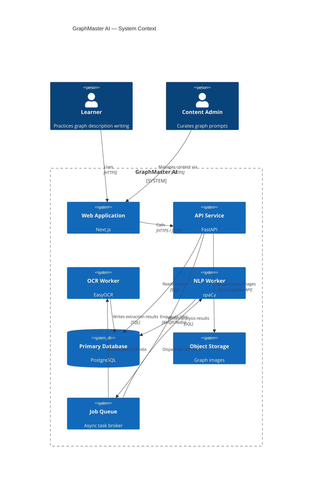
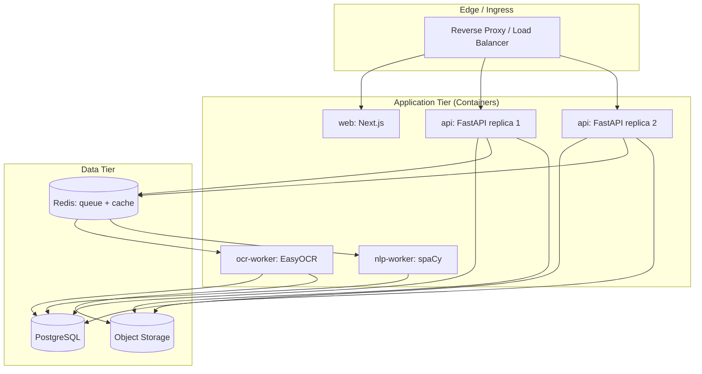

# System Architecture

## 1. Purpose and Scope

GraphMaster AI is an AI-powered, gamified platform for practicing **graph/chart description writing** in the style of IELTS/TOEFL Academic Writing Task 1. A user is presented with a data visualization (bar chart, line graph, pie chart, table, process diagram), writes a descriptive paragraph, and receives automated feedback on vocabulary usage and structure, along with XP, achievements, and leaderboard progress.

This document defines the system's major components, their responsibilities, and how they communicate. It is the entry point for all other architecture documents in this set:

| Doc | Topic |
|---|---|
| [02-database-schema.md](./02-database-schema.md) | Relational schema |
| [03-er-diagram.md](./03-er-diagram.md) | Entity-relationship diagram |
| [04-api-design.md](./04-api-design.md) | REST API contract |
| [05-backend-architecture.md](./05-backend-architecture.md) | FastAPI service internals |
| [06-frontend-architecture.md](./06-frontend-architecture.md) | Next.js application internals |
| [07-ocr-architecture.md](./07-ocr-architecture.md) | EasyOCR extraction pipeline |
| [08-nlp-architecture.md](./08-nlp-architecture.md) | spaCy vocabulary/writing analysis pipeline |
| [09-gamification-architecture.md](./09-gamification-architecture.md) | XP, achievements, leaderboard |

## 2. Architectural Style

GraphMaster follows a **containerized service-oriented architecture** with a clear separation between synchronous request handling and asynchronous, compute-heavy analysis work:

- A **Next.js** web application serves the UI and handles user-facing rendering.
- A **FastAPI** backend exposes a REST API, owns business logic, and orchestrates OCR/NLP/gamification workflows.
- **OCR (EasyOCR)** and **NLP (spaCy)** run as isolated worker processes consumed via an internal job queue, decoupling slow inference work from the request/response cycle.
- **PostgreSQL** is the single system of record.
- Uploaded graph images are stored in **object storage**, not the database.

The system is deliberately **cloud-agnostic**: every component ships as a Docker container with no hard dependency on a specific cloud vendor's managed services, so it can run on a single VPS via Docker Compose for early stages, or be lifted into a Kubernetes/ECS-style orchestrator later without redesign.

## 3. System Context Diagram

## 4. Major Components

### 4.1 Web Application (Next.js)
Server-rendered/hybrid React application. Renders graph prompts, the writing editor, feedback views, dashboards, achievements, and leaderboards. Talks to the backend exclusively through the REST API — never accesses the database or object storage directly. See [06-frontend-architecture.md](./06-frontend-architecture.md).

### 4.2 API Service (FastAPI)
Owns authentication, authorization, request validation, business rules, and orchestration of OCR/NLP/gamification workflows. Publishes jobs to the queue and exposes polling/webhook endpoints so the frontend can retrieve results once processing completes. See [05-backend-architecture.md](./05-backend-architecture.md) and [04-api-design.md](./04-api-design.md).

### 4.3 Job Queue
An internal message broker (e.g., Redis-backed task queue) decouples the API from OCR/NLP inference latency. The API enqueues a job and returns immediately (202 Accepted); workers process jobs and persist results, and the frontend polls or subscribes for completion.

### 4.4 OCR Worker (EasyOCR)
Consumes uploaded graph images, extracts embedded text (axis labels, legends, titles, data callouts). Runs as a separate containerized process so GPU/CPU-bound inference does not block API request threads. See [07-ocr-architecture.md](./07-ocr-architecture.md).

### 4.5 NLP Worker (spaCy)
Consumes a learner's submitted description text, evaluates vocabulary richness, grammar signals, and structural conventions, and produces a scored analysis. See [08-nlp-architecture.md](./08-nlp-architecture.md).

### 4.6 Primary Database (PostgreSQL)
System of record for users, graph prompts, submissions, OCR/NLP results, and all gamification state. See [02-database-schema.md](./02-database-schema.md).

### 4.7 Object Storage
Stores original graph prompt images and any user-uploaded assets. Referenced from the database by URL/key, never inlined as binary data.

## 5. Deployment Topology

Each box is an independently deployable Docker image. Redis serves a dual role as the job queue broker and a general-purpose cache (leaderboard snapshots, session lookups). The API tier is stateless and horizontally scalable; OCR/NLP workers scale independently based on queue depth since they are the most resource-intensive components.

## 6. Environment Strategy

| Environment | Purpose | Notes |
|---|---|---|
| **Local (dev)** | Developer machines | Docker Compose brings up all services + seeded PostgreSQL + local object storage emulator |
| **Staging** | Pre-production validation | Mirrors production topology at reduced scale; used for QA and content review |
| **Production** | Live traffic | Full topology with autoscaled API/worker replicas |

Configuration is environment-driven (12-factor style): each service reads connection strings, secrets, and feature flags from environment variables injected at container start, never hardcoded.

## 7. Scaling and Reliability

- **Stateless API tier**: any number of FastAPI replicas can run behind the load balancer; session state lives in the database/JWT, not in-process memory.
- **Independent worker scaling**: OCR and NLP workers scale on queue depth, isolating expensive inference from API latency budgets.
- **Idempotent job processing**: each queued job carries a unique job ID; workers upsert results keyed by job ID so retries after a crash do not duplicate work.
- **Database as the single source of truth**: no component holds authoritative state outside PostgreSQL, simplifying backup/restore and disaster recovery.
- **Graceful degradation**: if OCR/NLP workers fall behind, submissions remain in a `pending` state and the UI communicates this rather than failing the request.

## 8. Cross-Cutting Concerns

- **Authentication**: JWT-based bearer tokens issued by the API; see [04-api-design.md](./04-api-design.md).
- **Authorization**: role-based (`learner`, `content_admin`) enforced at the API layer.
- **Logging**: structured (JSON) logs from every service, correlated by a request/job ID propagated through headers and job payloads.
- **Observability**: each service exposes health and readiness endpoints; metrics (request latency, queue depth, worker throughput) are scraped centrally.
- **Secrets management**: database credentials, object storage keys, and JWT signing keys are injected via environment variables from a secrets manager, never committed to source control.
