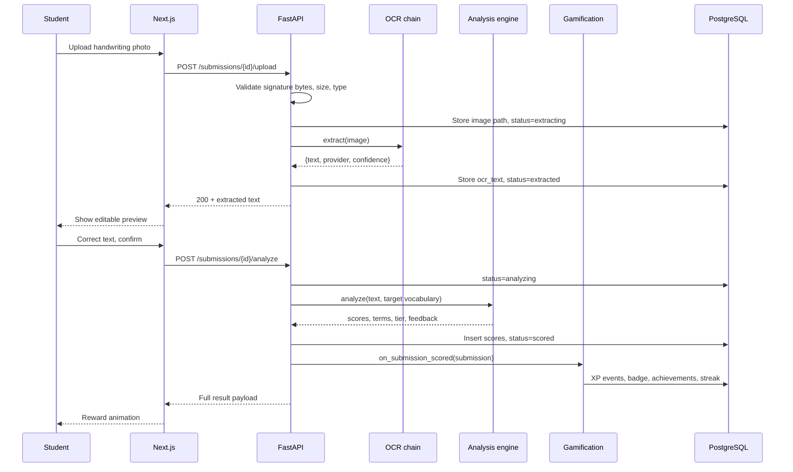
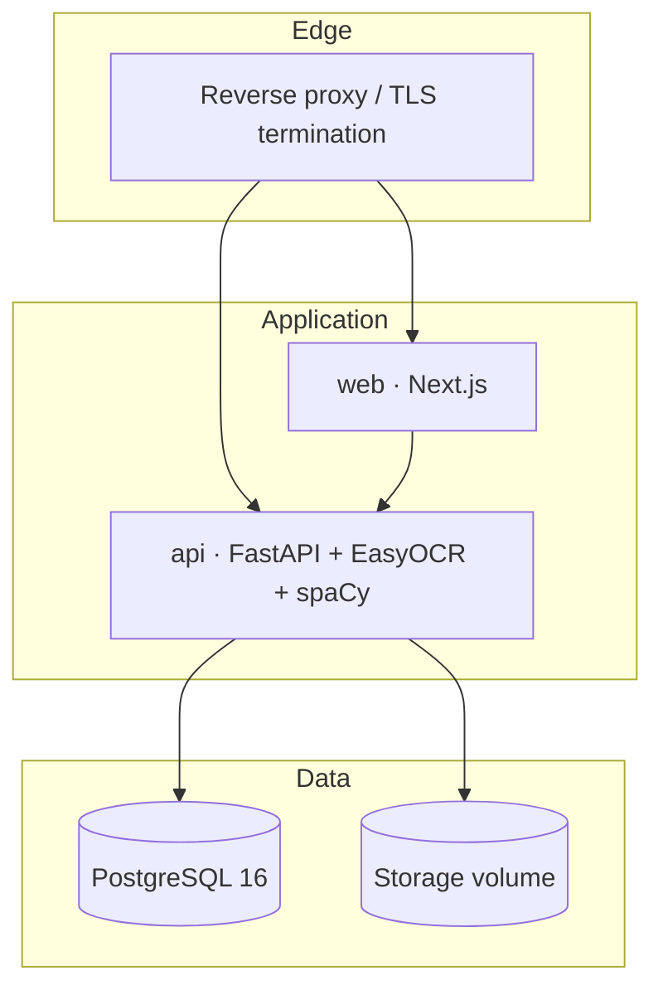

# System Architecture

> **Revision 2.0** — realigned to the product specification. The most
> significant change from revision 1.0: OCR now runs against **the student's
> handwritten answer**, not the graph image, and analysis runs **synchronously**
> rather than behind a Redis worker queue. See
> [../PROJECT_PLAN.md](../PROJECT_PLAN.md) §2–§3 for the reasoning.

## 1. Purpose and scope

GraphMaster is an AI-powered gamified platform for practising **graph
description writing** in academic English. A student is shown a chart, writes a
description either by typing or by photographing handwriting, and receives a
vocabulary-focused score with animated gamified feedback, XP, achievements and
leaderboard placement.

This document defines the major components and how they communicate. It is the
entry point for the rest of the set:

| Doc | Topic |
|---|---|
| [../00-srs.md](../00-srs.md) | Requirements specification |
| [../PROJECT_PLAN.md](../PROJECT_PLAN.md) | Sprint plan and design decisions |
| [02-database-schema.md](./02-database-schema.md) | Relational schema |
| [03-er-diagram.md](./03-er-diagram.md) | Entity-relationship diagram |
| [04-api-design.md](./04-api-design.md) | REST API contract |
| [05-backend-architecture.md](./05-backend-architecture.md) | FastAPI internals |
| [06-frontend-architecture.md](./06-frontend-architecture.md) | Next.js internals |
| [07-ocr-architecture.md](./07-ocr-architecture.md) | OCR extraction pipeline |
| [08-nlp-architecture.md](./08-nlp-architecture.md) | Vocabulary analysis and scoring |
| [09-gamification-architecture.md](./09-gamification-architecture.md) | XP, tiers, achievements, leaderboard |

## 2. Architectural style

GraphMaster is a **modular monolith**: a single FastAPI application composed of
clearly bounded modules, each with its own routers, services and repositories,
communicating through in-process service interfaces rather than over a network.

```
┌─────────────────────────────────────────────────────────┐
│                    Next.js web client                    │
└───────────────────────────┬─────────────────────────────┘
                            │ HTTPS / JSON
┌───────────────────────────▼─────────────────────────────┐
│                   FastAPI application                    │
│                                                          │
│  auth │ users │ classes │ graphs │ vocabulary            │
│  ─────────────────────────────────────────────           │
│  submissions │ ocr │ analysis │ gamification │ analytics  │
└──────────┬──────────────────────────┬────────────────────┘
           │ SQL                      │ files
┌──────────▼──────────┐    ┌──────────▼──────────┐
│    PostgreSQL 16    │    │   Storage backend   │
│                     │    │  (local disk / S3)  │
└─────────────────────┘    └─────────────────────┘
```

### 2.1 Why a modular monolith rather than microservices

Revision 1.0 specified separate OCR and NLP worker containers behind a Redis
queue. That was reconsidered for three reasons:

1. **The specification requires an interactive OCR preview.** FR-4.6 and FR-4.7
   require the extracted text to be shown to the student and made editable
   *before* analysis runs. That is a request-scoped, human-in-the-loop
   interaction. A fire-and-forget queue fights the flow rather than serving it.

2. **Deployment target.** The specification names Render, Railway and small VPS
   hosts. A three-container stack (web, api, database) fits comfortably on those
   platforms' free and hobby tiers; a six-container stack with Redis and two
   workers does not.

3. **Actual cost of the work.** spaCy analysis of a 300-word paragraph completes
   in milliseconds. Only OCR is genuinely slow (1–3 s), and it is already a step
   the student is actively waiting on, so moving it off-request buys nothing.

Module boundaries are still enforced in code — services never reach into another
module's repositories — so extraction into separate deployables remains a
mechanical change if classroom load ever demands it. The `JobRunner` abstraction
in [05-backend-architecture.md](./05-backend-architecture.md) §5 is the seam
where a Celery or RQ backend would attach.

## 3. Component responsibilities

### 3.1 Web client (Next.js 15, App Router)
Renders every screen, from the landing page to the reward animations. Talks to
the backend exclusively through the REST API; never touches the database or
storage directly. Charts are drawn client-side with Chart.js from the
`graphs.chart_data` payload. See
[06-frontend-architecture.md](./06-frontend-architecture.md).

### 3.2 API application (FastAPI, Python 3.12)
Owns authentication, authorisation, validation, business rules and all
analysis orchestration. Organised into the modules listed in §2. See
[05-backend-architecture.md](./05-backend-architecture.md).

### 3.3 OCR subsystem
Extracts text from uploaded handwriting images through a provider chain —
Google Vision, then EasyOCR, then Tesseract — skipping unavailable providers.
Runs in-process. See [07-ocr-architecture.md](./07-ocr-architecture.md).

### 3.4 Analysis subsystem
Runs the spaCy/NLTK vocabulary detection and scoring pipeline, producing the
vocabulary score, writing score, final score, missing-term list, reward tier and
feedback. See [08-nlp-architecture.md](./08-nlp-architecture.md).

### 3.5 Gamification subsystem
Awards XP, evaluates achievement rules, grants tier badges, maintains streaks
and materialises leaderboards. Invoked as a single call at the end of scoring so
the rules live in exactly one place. See
[09-gamification-architecture.md](./09-gamification-architecture.md).

### 3.6 PostgreSQL
Single system of record for everything in
[02-database-schema.md](./02-database-schema.md).

### 3.7 Storage backend
Holds student handwriting uploads, avatar art and generated report files.
Accessed through a narrow interface (`save`, `open`, `url`, `delete`) with a
local-disk implementation by default and an S3-compatible implementation
available without touching business logic (NFR-6.4).

## 4. Primary flow — handwritten submission



The typed-answer flow is the same minus the upload and extraction steps: the
submission goes straight from `draft` to `analyzing`.

## 5. Deployment topology



Three containers. The API image carries the EasyOCR and spaCy models, baked in
at build time rather than downloaded on first request — a cold-start model fetch
would blow past the 10-second OCR budget in NFR-1.3 and would fail entirely on
hosts without outbound network access at runtime.

## 6. Environment strategy

| Environment | Composition |
|---|---|
| **Local** | `docker compose up` — web, api, postgres, seeded data, local storage volume |
| **Staging** | Same topology, managed Postgres, persistent volume |
| **Production** | Same topology behind TLS, managed Postgres with backups, object storage |

Configuration is entirely environment-driven (12-factor). Every variable is
documented in `.env.example`; nothing is read ad hoc from `os.environ` inside
business logic, and misconfiguration fails at boot rather than at first use.

## 7. Scaling and reliability

- **Stateless API.** Session state lives in JWTs and the database, so replicas
  scale horizontally behind the proxy with no sticky sessions.
- **Materialised leaderboards.** Rankings are precomputed into
  `leaderboard_entries` rather than ranked per request (NFR-1.4).
- **Graceful OCR degradation.** Provider failure falls through to the next
  provider; total failure marks the submission `failed` with a stored reason and
  preserves the uploaded image, so the student can retry or type instead
  (FR-4.9, NFR-3.2).
- **Reconstructable XP.** The append-only ledger means the denormalised
  `users.total_xp` can always be rebuilt (NFR-3.3).
- **Explicit failure states.** No operation leaves a submission silently
  pending; every terminal failure records `error_message`.

## 8. Cross-cutting concerns

| Concern | Approach |
|---|---|
| Authentication | JWT access tokens (30 min) + rotating refresh tokens stored hashed |
| Authorisation | Role dependencies (`student`/`teacher`/`admin`) declared at the router, plus ownership checks in services |
| Validation | Pydantic at every boundary; uploads verified by file signature, not extension |
| Rate limiting | Per-IP on auth endpoints, per-user on submission endpoints |
| Logging | Structured JSON with a request ID propagated through every layer |
| Health | `/health/live` and `/health/ready`, the latter checking database connectivity |
| Secrets | Environment variables only; `.env` git-ignored, `.env.example` committed |
