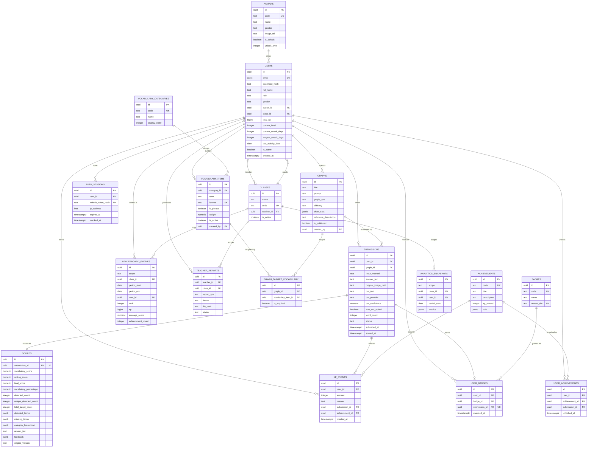

# Entity-Relationship Diagram

> **Revision 2.0** — regenerated for the schema in
> [02-database-schema.md](./02-database-schema.md) revision 2.0.

This diagram is the visual companion to the schema document. Entities,
attributes and cardinalities mirror it exactly.

## 1. Full ER diagram

## 2. Cardinality notes

| Relationship | Cardinality | Rationale |
|---|---|---|
| `AVATARS → USERS` | 1:N | Many students share the same default cartoon avatar; the avatar is reference data, not per-user data. |
| `CLASSES → USERS` | 1:N | A class enrols many students. A student belongs to at most one class in v1.0 — multi-class enrolment would need a join table, deliberately deferred. |
| `USERS → CLASSES` | 1:N | The reverse edge: one teacher owns many classes. Both edges point at `USERS` for different reasons, which is why the diagram shows two lines between them. |
| `GRAPHS → SUBMISSIONS` | 1:N | A graph is answered by many students and re-attempted by the same student (FR-3.7). |
| `GRAPHS ↔ VOCABULARY_ITEMS` | M:N via `GRAPH_TARGET_VOCABULARY` | A graph targets several terms; a term is targeted by several graphs. |
| `SUBMISSIONS → SCORES` | 1:1 | Exactly one score row per scored submission, enforced by `UNIQUE (submission_id)`. |
| `SUBMISSIONS → USER_BADGES` | 1:0..1 | A scored submission yields exactly one tier badge; a draft or failed one yields none. |
| `USERS → XP_EVENTS` | 1:N | Append-only ledger; every award is a new row. |
| `ACHIEVEMENTS → USER_ACHIEVEMENTS` | 1:N | Many students unlock the same achievement, but `UNIQUE (user_id, achievement_id)` caps it at once each (FR-8.8). |
| `BADGES → USER_BADGES` | 1:N | Badges are re-awardable — a student earns Rising Writer on every 60–89% attempt. |
| `CLASSES → LEADERBOARD_ENTRIES` | 1:N | Rows exist only where `scope = 'class'`, enforced by a `CHECK` constraint. |

## 3. Three design decisions worth explaining

### 3.1 Why badges and achievements are separate tables

They look similar enough to merge, but they behave differently:

- An **achievement** is a permanent, one-time milestone. *First Submission* can
  only ever happen once, and `UNIQUE (user_id, achievement_id)` guarantees it.
- A **badge** reflects performance on a single attempt. A student earns *Rising
  Writer* every time they score 60–89%, and earning it does not stop them
  earning *Practice Needed* on the next attempt.

Merging them would force one of the two to carry a meaningless constraint —
either achievements become re-awardable, breaking FR-8.8, or badges become
one-time, so a student's tenth attempt shows no badge at all.

### 3.2 Why the XP ledger is not a counter

A single `users.total_xp` counter would lose the history of *how* XP was earned.
That history is needed for the activity feed, for period-scoped leaderboards
(weekly XP cannot be derived from a lifetime total), for detecting XP farming,
and for retroactively correcting a scoring bug without guessing at the original
values.

Modelling it as an append-only ledger with a maintained cache on `users` gives
both: O(1) profile reads and a fully replayable history. The partial unique
index on `(user_id, created_at::date) WHERE reason = 'streak_bonus'` makes the
once-per-day rule of FR-8.3 a database guarantee rather than a race condition
waiting for two concurrent submissions.

### 3.3 Why `scores` stores denormalised term lists

`detected_terms` and `missing_terms` duplicate information that could, in
principle, be recomputed by re-running the analyser. They are stored anyway
because the vocabulary library is **mutable** — a teacher can deactivate a term
or change a graph's target set at any time. Without the stored lists, reopening
a result from last month would show feedback that no longer matches the score
the student actually received.
