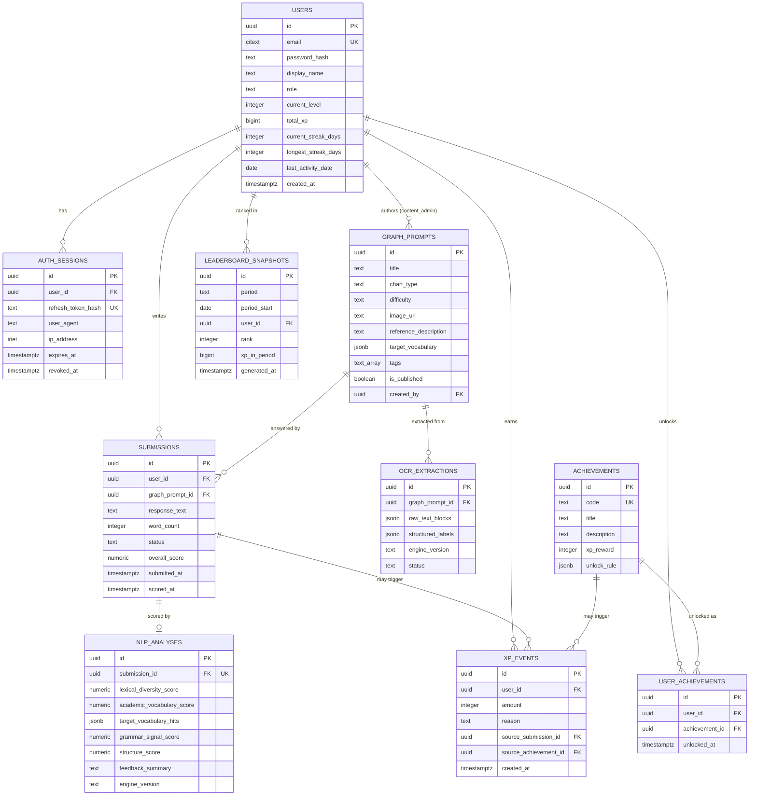

# Entity-Relationship Diagram

This diagram is the visual companion to [02-database-schema.md](./02-database-schema.md). All entities, attributes, and cardinalities below mirror that document exactly.

## 1. Full ER Diagram

## 2. Cardinality Notes

| Relationship | Cardinality | Rationale |
|---|---|---|
| `USERS → SUBMISSIONS` | 1:N | A learner submits many attempts over time, across many prompts. |
| `GRAPH_PROMPTS → SUBMISSIONS` | 1:N | A prompt is reused by many learners and re-attempted by the same learner. |
| `GRAPH_PROMPTS → OCR_EXTRACTIONS` | 1:N (practically 1:1 active) | OCR is run per prompt image, not per submission — a prompt's extracted labels are cached and reused across all submissions answering it. A new row is added only when the image changes or OCR is re-run with a newer engine version. |
| `SUBMISSIONS → NLP_ANALYSES` | 1:0..1 | Each submission is analyzed exactly once per scoring pass; `submission_id` is unique, enforcing at most one current analysis row. |
| `USERS → XP_EVENTS` | 1:N | Append-only ledger — every XP-earning action is a new row, never mutated. This makes `total_xp` fully reconstructable by replaying the ledger, which is the source of truth if the denormalized cache on `users` ever drifts. |
| `ACHIEVEMENTS → USER_ACHIEVEMENTS` | 1:N | Many learners unlock the same achievement; `(user_id, achievement_id)` is unique, so an achievement can only be unlocked once per user. |
| `ACHIEVEMENTS → XP_EVENTS` | 1:N (optional) | An achievement unlock optionally produces one XP event; the FK is nullable because most XP events originate from `submission_scored`, not achievements. |
| `USERS → LEADERBOARD_SNAPSHOTS` | 1:N | A user appears once per `(period, period_start)` snapshot; historical snapshots are retained for trend display. |

## 3. Why `xp_events` Is Modeled as a Ledger, Not a Counter

Storing `users.total_xp` as a mutable counter alone would lose the *history* of how XP was earned — needed for streak/activity feeds, anti-abuse auditing, and recomputation if a scoring bug requires retroactive correction. Modeling it as an **append-only ledger** (`xp_events`) with a denormalized cache on `users.total_xp` gives both: fast reads (no `SUM()` on every profile load) and a fully auditable, replayable history. See [09-gamification-architecture.md](./09-gamification-architecture.md) for how the cache is kept consistent with the ledger.
