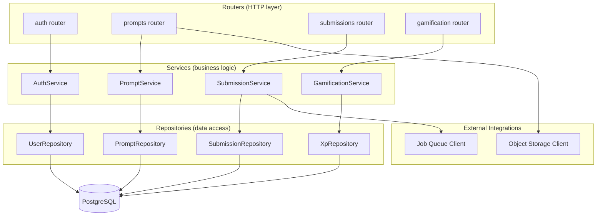
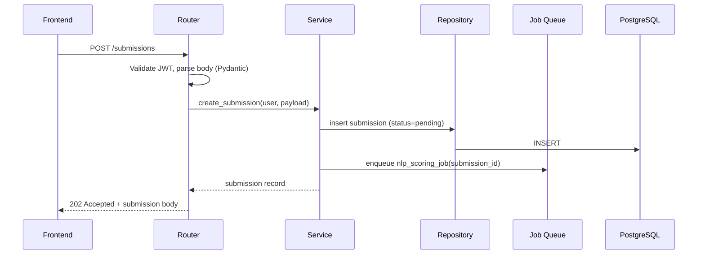

# Backend Architecture

## 1. Overview

The backend is a **FastAPI** service that owns authentication, business logic, and orchestration of the OCR/NLP/gamification workflows described in [01-system-architecture.md](./01-system-architecture.md). It exposes the REST API defined in [04-api-design.md](./04-api-design.md) and reads/writes the schema defined in [02-database-schema.md](./02-database-schema.md).

## 2. Layered Structure

The service follows a layered architecture to keep HTTP concerns, business rules, and data access independently testable:

- **Routers** handle HTTP concerns only: request parsing (Pydantic models), auth/role dependency checks, calling a service method, and mapping the result to an HTTP response. No business logic lives here.
- **Services** implement business rules: e.g., `SubmissionService.create_submission()` validates prompt existence, persists the submission, enqueues the NLP job, and returns the created record. Services are the unit of reuse across routers, background tasks, and (later) admin tooling.
- **Repositories** encapsulate all SQL/ORM access for one aggregate root each, keeping query logic out of services and giving services a narrow, mockable interface for testing.

## 3. Request Lifecycle

## 4. Dependency Injection

FastAPI's `Depends()` system wires the layers together:

- **Database session**: a request-scoped SQLAlchemy session, provided per request and closed on teardown.
- **Current user**: a dependency that decodes the JWT, loads the user, and raises `401`/`403` as appropriate — reused across every protected router.
- **Service instances**: constructed via dependency providers that inject the request-scoped session and any external clients (queue, object storage), so services never instantiate their own infrastructure clients.

This keeps handlers thin and makes services trivially testable by constructing them directly with fake repositories/clients in unit tests, bypassing the HTTP layer entirely.

## 5. Asynchronous Task Handling

OCR and NLP work is offloaded from the request/response cycle via the job queue introduced in [01-system-architecture.md](./01-system-architecture.md):

1. A router/service enqueues a job (`{job_id, job_type, payload}`) onto the Redis-backed queue and immediately returns `202 Accepted`.
2. Independent **worker processes** (separate containers, not part of the API's request-handling event loop) consume jobs by type:
   - `ocr_extraction` jobs → consumed by the OCR worker ([07-ocr-architecture.md](./07-ocr-architecture.md))
   - `nlp_scoring` jobs → consumed by the NLP worker ([08-nlp-architecture.md](./08-nlp-architecture.md))
3. Workers write results directly to PostgreSQL (`ocr_extractions`, `nlp_analyses`) and update the parent record's `status` column.
4. The frontend polls the corresponding `GET` endpoint until the status reaches a terminal state, per the async job pattern in [04-api-design.md](./04-api-design.md).

Jobs are processed **at-least-once**; every worker handler is written to be idempotent (upsert by `job_id`/`submission_id` rather than blind insert) so a redelivered job after a worker crash does not corrupt state.

## 6. Configuration Management

All configuration is loaded from environment variables at process start via a single typed settings object (e.g., Pydantic `BaseSettings`), validated eagerly so misconfiguration fails fast at boot rather than at first use. No configuration is read ad hoc from `os.environ` inside business logic.

| Category | Examples |
|---|---|
| Database | connection URL, pool size |
| Auth | JWT signing key, token TTLs |
| Queue | broker URL |
| Object storage | endpoint, bucket, credentials |
| Feature flags | e.g. enable/disable new scoring rubric |

## 7. Error Handling Strategy

- **Domain exceptions**: services raise typed exceptions (`SubmissionNotFoundError`, `PromptNotPublishedError`, etc.) rather than HTTP exceptions — keeping services HTTP-agnostic.
- **Global exception handler**: a FastAPI exception handler maps domain exceptions to the HTTP error envelope defined in [04-api-design.md](./04-api-design.md), centralizing the domain-exception-to-status-code mapping in one place.
- **Validation errors**: Pydantic request model validation failures are caught by FastAPI's default handler, reformatted to match the shared error envelope.
- **Worker errors**: unhandled exceptions in OCR/NLP workers are caught at the job-processing boundary, logged with the job payload, and mark the parent record `status = 'failed'` with an `error_message` rather than crashing the worker process.

## 8. Integration Boundaries

- **OCR/NLP workers** are treated as black-box services reached only through the job queue and read back only through PostgreSQL — the API never calls EasyOCR/spaCy in-process, keeping heavy ML dependencies out of the request-serving containers.
- **Object storage** is accessed through a thin storage client interface (`upload()`, `get_url()`), so the underlying provider (S3-compatible, local disk in dev) is swappable without touching service code.
- **Gamification** is triggered as a side effect of `SubmissionService` (on successful scoring) and exposed as its own service (`GamificationService`) for the read-side endpoints, keeping XP/achievement rules centralized rather than duplicated at each call site — detailed in [09-gamification-architecture.md](./09-gamification-architecture.md).

## 9. Testing Strategy

| Layer | Test approach |
|---|---|
| Repositories | Integration tests against a real (containerized) PostgreSQL instance |
| Services | Unit tests with fake/in-memory repositories and a fake queue client |
| Routers | Contract tests using FastAPI's test client, asserting status codes and response shapes against [04-api-design.md](./04-api-design.md) |
| Workers | Unit tests around the pure extraction/scoring functions, plus integration tests that a job payload produces the expected database row |
