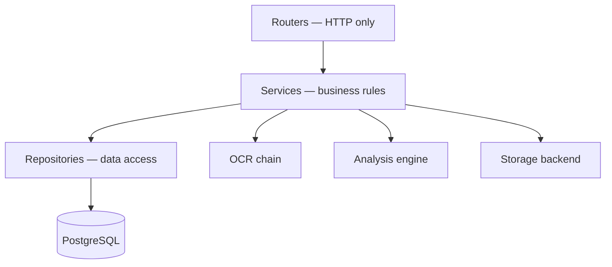

# Backend Architecture

> **Revision 2.0** — realigned to the modular-monolith decision in
> [01-system-architecture.md](./01-system-architecture.md) §2.1 and to the
> module set required by the specification.

## 1. Overview

A **FastAPI** application on Python 3.12, organised as a modular monolith with
strict layering: routers handle HTTP, services hold business rules, repositories
own data access. It exposes the contract in [04-api-design.md](./04-api-design.md)
over the schema in [02-database-schema.md](./02-database-schema.md).

## 2. Folder structure

```
backend/
├── app/
│   ├── main.py                  # App factory, middleware, exception handlers
│   ├── core/
│   │   ├── config.py            # Typed settings (pydantic-settings)
│   │   ├── security.py          # Hashing, JWT encode/decode
│   │   ├── exceptions.py        # Domain exception hierarchy
│   │   ├── logging.py           # Structured JSON logging
│   │   └── rate_limit.py        # Token-bucket limiter
│   ├── db/
│   │   ├── base.py              # DeclarativeBase, naming convention
│   │   ├── session.py           # Engine, session factory, DI provider
│   │   └── seed/                # Idempotent seed data
│   ├── models/                  # SQLAlchemy 2.0 ORM models
│   ├── schemas/                 # Pydantic request/response models
│   ├── repositories/            # One repository per aggregate root
│   ├── services/                # Business logic
│   ├── api/
│   │   ├── deps.py              # Shared dependencies
│   │   └── v1/                  # Routers, one module per resource
│   ├── ocr/                     # Provider chain (07-ocr-architecture.md)
│   ├── nlp/                     # Analysis engine (08-nlp-architecture.md)
│   ├── gamification/            # Pure rules: periods, streaks, achievements
│   ├── storage/                 # Storage backend abstraction
│   └── reports/                 # One document description, three writers
├── alembic/versions/            # Migrations
├── tests/{unit,integration,api}/
├── pyproject.toml
├── Dockerfile
└── .env.example
```

## 3. Layering



The rule that keeps this honest: **each layer may only call the layer directly
below it**. A router never touches a repository, and a service never constructs
its own database session or storage client — both arrive by injection.

### 3.1 Routers
Parse and validate requests via Pydantic, declare role dependencies, call one
service method, shape the response. No business logic, no queries.

### 3.2 Services
Own the rules. `SubmissionService.analyze()` loads the submission, checks
ownership and state, resolves the target vocabulary, runs the analyser, persists
the score, and calls `GamificationService` — all in one transaction.

Services raise **domain exceptions** (`SubmissionNotFoundError`,
`SubmissionAlreadyScoredError`), never `HTTPException`. Keeping services free of
HTTP types is what makes them callable from tests, the seeding CLI and the
report generator without a request in scope.

### 3.3 Repositories
All SQL for one aggregate root. Services receive them as constructor arguments,
so a unit test substitutes a fake without a database.

## 4. Dependency injection

FastAPI's `Depends` wires everything:

| Dependency | Provides |
|---|---|
| `get_db` | Request-scoped `AsyncSession`, committed or rolled back on teardown |
| `get_current_user` | Decodes the JWT, loads the user, raises `401` |
| `require_role(*roles)` | Role gate, raises `403` |
| `get_*_service` | A service with its repositories and clients already injected |
| `get_ocr_chain` | The process-wide provider chain |
| `get_analyzer` | The process-wide spaCy analyser |

The OCR chain and the analyser are **application-scoped singletons** created at
startup, not per request. Both load models measured in tens of megabytes;
constructing them per request would add seconds to every call.

## 5. The `JobRunner` seam

Analysis runs synchronously ([01-system-architecture.md](./01-system-architecture.md)
§2.1), but behind an interface:

```python
class JobRunner(Protocol):
    async def run(self, fn: Callable[..., T], *args, **kwargs) -> T: ...
```

`InlineJobRunner` awaits directly and is the default. Should classroom load ever
justify it, a `CeleryJobRunner` attaches here and the endpoints switch to the
`202 Accepted` + polling pattern without any service being rewritten.

## 6. Configuration

One typed settings object loaded from the environment at startup and validated
eagerly, so a missing secret fails at boot rather than on the first request that
needs it.

| Group | Variables |
|---|---|
| App | `ENVIRONMENT`, `DEBUG`, `SECRET_KEY`, `ALLOWED_ORIGINS` |
| Database | `DATABASE_URL`, `DB_POOL_SIZE` |
| Auth | `JWT_ALGORITHM`, `ACCESS_TOKEN_EXPIRE_MINUTES`, `REFRESH_TOKEN_EXPIRE_DAYS` |
| Storage | `STORAGE_BACKEND`, `STORAGE_LOCAL_PATH`, `S3_*` |
| Uploads | `MAX_UPLOAD_SIZE_MB`, `ALLOWED_IMAGE_TYPES` |
| OCR | `OCR_PROVIDER_ORDER`, `GOOGLE_APPLICATION_CREDENTIALS`, `EASYOCR_MODEL_DIR`, `TESSERACT_CMD` |
| Scoring | `VOCABULARY_WEIGHT`, `WRITING_WEIGHT`, tier thresholds |
| Gamification | `XP_PER_SUBMISSION`, `XP_HIGH_SCORE_BONUS`, `XP_STREAK_BONUS`, `HIGH_SCORE_THRESHOLD`, `MAX_LEVEL`, `PLATFORM_TIMEZONE`, `LEADERBOARD_CACHE_MINUTES` |
| Reports | Optional `openpyxl` and `reportlab`; absence answers 503, never 500 |
| Rate limits | Per-group limits from [04-api-design.md](./04-api-design.md) §5.3 |

Scoring weights and XP values are configuration rather than constants
specifically so a research study can retune the rubric without a redeploy.

## 7. Error handling

Domain exceptions carry a `code` and a default HTTP status. A single global
handler maps them to the error envelope of
[04-api-design.md](./04-api-design.md) §5.2, so the mapping lives in one place
rather than being repeated in every router.

```
GraphMasterError
├── NotFoundError            → 404
├── PermissionDeniedError    → 403
├── ConflictError            → 409
├── ValidationError          → 422
├── OCRError                 → 422
└── RateLimitError           → 429
```

Unhandled exceptions return a generic `500` with a request ID; the traceback is
logged, never returned. A stack trace in a response body is a disclosure of
internal structure to anyone who can trigger an error.

## 8. Transactions

One request, one transaction, committed at teardown. Scoring is the case that
makes this matter: score insert, XP events, badge, achievements and user counter
updates all commit together or not at all. A partial commit would show the
student a score with no XP, which reads as lost work.

### 8.1 The deliberate exceptions

Two services commit. `SubmissionService._record_extraction_failure` has to. The rule above rolls back on *any* exception, and a recognition failure is
reported by raising one — so a `failed` status written the ordinary way would be
erased by the very error reporting it, and the student would get a 422 against a
submission still sitting in `extracting` with no record of what went wrong.
`failed` would be a status the schema declares and the code can never reach.

Only that submission's own columns are pending at the point of the commit, so it
cannot smuggle out an unrelated half-finished write. The test suite's isolation
survives it because the test session joins an already-open transaction, where a
commit releases a savepoint rather than publishing anything —
`tests/integration/test_submission_concurrency.py` asserts exactly that, since a
regression there would silently leak rows between every test after a failed
upload.

`ReportService._record_failure` commits for exactly the same reason: an export
whose generation fell over must leave a `failed` row carrying the reason, and
the teacher must get that instead of a bare 500 with no trace of what they
asked for. Only that report's own columns are pending at the point of the
commit.

The shape of the rule: a service may commit only to record *its own* failure,
only when the alternative is a status the schema declares and the code can
never reach, and only where nothing else is pending in the transaction.

### 8.2 Exactly-once scoring

`analyze` locks the submission row (`SELECT … FOR UPDATE`) before reading its
status, so two concurrent calls serialise rather than both observing a
not-yet-scored row. Without the lock both would run the engine and both would
insert a score — one dying on the unique constraint with a 500 — and both would
award XP for a single piece of work, which is a straightforward way to farm the
leaderboard.

The `analyzing` status is written inside that lock. It is transient by
construction today: nothing commits between it and `scored`, so a failure rolls
it back and the attempt stays retryable. It is written anyway because it is the
honest description of the state, and because moving analysis to a background
worker later needs the guard to already be correct.

The engine call is synchronous CPU work — a few hundred milliseconds of spaCy —
executed on the event loop while holding that row lock. Acceptable for a
single-instance deployment; the natural fix is a worker queue rather than a
thread pool, since spaCy's `Vocab` is mutated during parsing and is not safe to
share across threads.

### 8.3 Savepoints around writes a constraint may refuse

Several writes can legitimately be rejected by a constraint doing its job: the
daily streak bonus, an achievement unlock, a badge already attached to a
submission, and a leaderboard rebuild that lost a race. Each runs inside
`begin_nested()`, because in PostgreSQL a failed statement poisons the whole
transaction — and the transaction in question is holding the student's score.
Losing a submission over a bonus they simply did not qualify for would be a far
worse failure than a missing badge.

## 9. Security implementation

| Control | Implementation |
|---|---|
| Password hashing | bcrypt via `passlib`, per-user salt |
| Access tokens | HS256 JWT, 30-minute expiry, `jti` claim |
| Refresh tokens | 256-bit random, SHA-256 hashed at rest, rotated on use, family revoked on replay |
| RBAC | Declarative role dependency plus service-level ownership checks |
| SQL injection | SQLAlchemy parameterised queries exclusively; no string-built SQL |
| Upload safety | Magic-byte validation, generated filenames, stored outside any served directory |
| Rate limiting | Middleware, keyed per IP or per user by endpoint group |
| CORS | Explicit origin allowlist; never `*` with credentials |
| Headers | HSTS, `X-Content-Type-Options`, `X-Frame-Options`, CSP |

## 10. Testing

| Layer | Approach | Target |
|---|---|---|
| Core utilities | Pure unit tests — security, level curve, scoring maths | 95% |
| NLP engine | Unit tests over fixed text fixtures with known expected detections | 90% |
| OCR chain | Fake providers exercising fallthrough and total failure | 85% |
| Services | Unit tests with fake repositories | 85% |
| Repositories | Integration tests against a real PostgreSQL | 80% |
| API | Contract tests via `httpx.AsyncClient` asserting status codes and shapes | 85% |

Overall target 80%+ (NFR-5.2). Tests are written alongside each sprint rather
than deferred to sprint 9, which exists to close gaps and wire CI, not to write
the suite from scratch.
