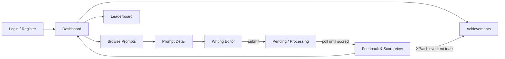

# Frontend Architecture

## 1. Overview

The frontend is a **Next.js** application (App Router) that renders the learner-facing experience and a lightweight content-admin experience. It communicates exclusively with the backend through the REST API defined in [04-api-design.md](./04-api-design.md); it never accesses PostgreSQL or object storage directly.

## 2. Rendering Strategy

| Concern | Approach |
|---|---|
| Prompt listing/browsing | Server Components — data fetched at request time on the server, good for SEO-able, cacheable content |
| Writing editor (submission composition) | Client Component — needs local interactive state (textarea, word count, autosave draft) |
| Results/feedback view | Server Component for initial load, with a Client Component sub-tree that polls for async scoring completion |
| Dashboard / profile / streak | Server Component, revalidated on navigation |
| Leaderboard | Server Component with a short cache TTL (matches the `leaderboard_snapshots` refresh cadence from [09-gamification-architecture.md](./09-gamification-architecture.md)) |
| Achievements gallery | Server Component |
| Admin prompt authoring | Client Component (form-heavy, immediate validation feedback) |

General rule: default to Server Components; opt into Client Components only where interactivity, browser-only APIs, or polling is required, keeping JS bundle size and client-side data fetching to a minimum.

## 3. Application Flow Map



- **Dashboard**: entry point after login — shows level, XP, streak, recent submissions, and quick links.
- **Browse Prompts**: filterable list (`chart_type`, `difficulty`, `tags`) backed by `GET /prompts`.
- **Prompt Detail**: renders the graph image and prompt metadata before the learner starts writing.
- **Writing Editor**: composition surface; on submit, calls `POST /submissions` and transitions to the pending state per the async job pattern in [04-api-design.md](./04-api-design.md).
- **Pending / Processing**: a lightweight polling view (`GET /submissions/{id}`) until `status` is terminal.
- **Feedback & Score View**: renders `nlp_analyses` results (vocabulary score, structure score, feedback text) fetched from `GET /submissions/{id}/analysis`, and surfaces any XP/achievement changes that resulted from the submission.
- **Leaderboard / Achievements**: read-only gamification views backed by `/gamification/*` endpoints.

## 4. State Management

- **Server state** (data owned by the API — prompts, submissions, XP, leaderboard) is fetched via Server Components where possible, and via a thin data-fetching hook layer (e.g., a shared `useApiQuery`/`useApiMutation` pattern) for client-side polling and mutations. No global client-side cache duplicates what the server can provide directly.
- **Client/UI state** (editor draft text, form inputs, modal visibility) is local component state; no global store is introduced unless cross-tree sharing is demonstrably needed (e.g., a toast/notification system for achievement unlocks), in which case a minimal context provider is used rather than a heavyweight state library.
- **Auth state**: the access token is held in memory (React context) for the session; the refresh token is stored in an `HttpOnly` cookie set by the backend, never exposed to client-side JavaScript, mitigating XSS token theft.

## 5. API Client Layer

A single typed API client module wraps all backend calls:

- Centralizes base URL, auth header injection, and error envelope parsing (per [04-api-design.md](./04-api-design.md) §5.3).
- On a `401` response, transparently attempts a token refresh (`POST /auth/refresh`) once, then retries the original request or redirects to login on failure.
- Exposes one function per API operation (e.g., `createSubmission()`, `getLeaderboard()`), so components never construct `fetch` calls or endpoint URLs directly — keeping the API contract in one place and easy to update alongside [04-api-design.md](./04-api-design.md).

## 6. Auth & Session Handling

1. Login/register calls issue an access token (returned in the response body, held in memory) and a refresh token (set as an `HttpOnly`, `Secure` cookie by the backend).
2. Protected Server Components read the session via a server-side helper that validates the access token (or triggers a refresh) before rendering, redirecting to `/login` on failure.
3. Protected Client Components rely on the in-memory auth context populated at app shell mount; a full page reload re-establishes it via the refresh cookie.
4. Role-gated UI (content-admin authoring screens) checks `role` from the decoded token client-side for UX purposes only — the backend remains the authoritative enforcement point per [04-api-design.md](./04-api-design.md) §4.

## 7. Component Organization

```
app/
  (auth)/login, register
  (learner)/dashboard
  (learner)/prompts/[id]
  (learner)/submissions/[id]
  (learner)/leaderboard
  (learner)/achievements
  (admin)/prompts/new, [id]/edit
components/
  ui/            # generic, presentation-only building blocks
  prompts/       # prompt card, prompt filter bar, prompt image viewer
  editor/        # writing editor, word-count meter, autosave indicator
  feedback/      # score breakdown, vocabulary highlight, feedback summary
  gamification/  # xp bar, streak indicator, achievement badge, leaderboard table
lib/
  api-client/    # typed API client described in §5
  auth/          # session helpers described in §6
```

Route segments map directly to the flow map in §3; feature-specific components live under `components/<feature>/`, while `components/ui/` holds only generic, reusable presentation elements with no data-fetching or business logic.

## 8. Performance Considerations

- Graph prompt images are served through Next.js image optimization, sized appropriately for the editor vs. thumbnail views.
- The pending/processing polling view uses backoff (e.g., poll every 2s, capped) rather than fixed-interval hammering, to reduce load on the API tier during OCR/NLP processing spikes described in [01-system-architecture.md](./01-system-architecture.md).
- Leaderboard and achievement catalog data is cached at the Server Component level with revalidation tags, invalidated when the backend's leaderboard snapshot job runs (see [09-gamification-architecture.md](./09-gamification-architecture.md)).
