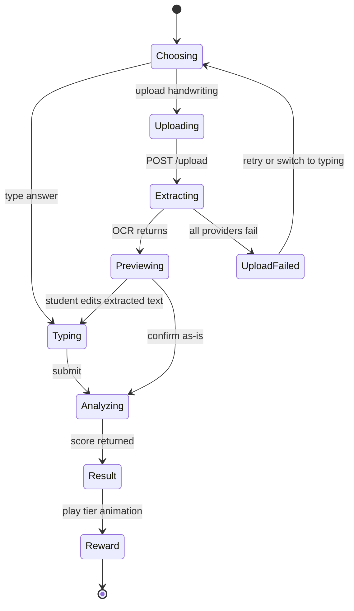

# Frontend Architecture

> **Revision 2.0** — realigned to the specification's twelve pages, three roles
> and reward-animation requirements.

## 1. Overview

A **Next.js 15** application (App Router) in **TypeScript**, styled with
**Tailwind CSS** and **shadcn/ui**, animated with **Framer Motion** and
**Lottie**, charting with **Chart.js**. It talks to the backend only through the
REST API of [04-api-design.md](./04-api-design.md).

## 2. Folder structure

```
frontend/
├── app/
│   ├── (marketing)/page.tsx           # Landing
│   ├── (auth)/login, register, forgot-password
│   ├── (student)/dashboard
│   ├── (student)/practice, practice/[graphId]
│   ├── (student)/submissions/[id]     # Result + reward animation
│   ├── (student)/leaderboard, achievements
│   ├── (teacher)/teacher/{dashboard,students,submissions,graphs,vocabulary,analytics,reports}
│   ├── (admin)/admin/{users,classes,analytics}
│   ├── profile, settings
│   └── layout.tsx
├── components/
│   ├── ui/                            # shadcn primitives
│   ├── charts/                        # Chart.js wrappers
│   ├── practice/                      # Editor, upload, OCR preview
│   ├── gamification/                  # Avatar, rewards, XP bar, badges
│   ├── dashboard/, teacher/, layout/
├── lib/
│   ├── api/                           # Typed client, one module per resource
│   ├── auth/, hooks/, utils/
├── types/                             # Types mirroring API schemas
└── styles/
```

## 3. Rendering strategy

| Surface | Approach | Why |
|---|---|---|
| Landing | Server Component, static | Public, cacheable, SEO |
| Auth pages | Client | Form state and validation |
| Dashboard | Server shell + client widgets | Data fetched server-side; charts need the browser |
| Practice page | Client | Chart.js, editor state, autosave, upload |
| Result page | Client | Animation sequencing and audio |
| Leaderboard | Server, short revalidate | Matches the materialisation cadence |
| Teacher tables | Client | Filtering, sorting, pagination |

Default to Server Components; opt into Client Components only for
interactivity, browser APIs or animation.

## 4. Design system

| Token | Role |
|---|---|
| Primary | Purple |
| Secondary | Blue |
| Accent | Gold — reserved for crown tier, XP and level-ups |
| Tier colours | Crown gold · Flower rose · Steady sky · Hammer amber |

Gold is deliberately reserved. If it appears on ordinary buttons, the crown
reward loses the visual distinction that makes it feel earned.

Every colour is a CSS custom property defined for both light and dark themes
(NFR-4.2); no component hardcodes a hex value.

## 5. State management

- **Server state** — fetched in Server Components where possible; TanStack Query
  for client-side fetching, caching and invalidation.
- **UI state** — local `useState`. No global store is introduced without a
  demonstrated cross-tree need.
- **Auth state** — access token in memory via context; refresh token in an
  `HttpOnly` cookie the client cannot read.
- **Reward sequence** — a dedicated state machine (`idle → entering → peak →
  settling → done`), because a sequence with sound, particles and a skip control
  is not expressible as a pile of booleans without race conditions.

## 6. API client

One typed module per resource under `lib/api/`, over a shared fetch wrapper that
centralises the base URL, auth header, error-envelope parsing and refresh
retry. On `401` it attempts one refresh, retries the original request, and
redirects to login if that fails. Components never call `fetch` directly, so the
API contract has exactly one representation in the codebase.

## 7. The practice flow



`Previewing` is a real state the student acts on, not a spinner — FR-4.7
requires the extraction to be editable before analysis.

## 8. Reward animations

| Tier | Sequence |
|---|---|
| Crown | Avatar celebrates → crown descends and settles → sparkle particles → confetti burst → victory sound → title card "Graph King"/"Graph Queen" |
| Flower | Flower blooms and rotates → avatar cheers → positive chime → "Rising Writer" |
| Steady | Encouraging pulse → avatar nods → soft chime → "Steady Learner" |
| Hammer | Cartoon hammer falls → bonk → dizzy stars → brief fall → **recovery** → "Keep Practicing! You Can Improve!" |

Rules enforced in the components themselves, not left to the designer's
discretion:

1. **Every sequence is skippable and replayable** (FR-7.9).
2. **Sound is muted until opted in** (FR-7.11).
3. **`prefers-reduced-motion` collapses any sequence to a static card** carrying
   the same message (FR-7.10) — the information is never only in the motion.
4. **The hammer always ends in recovery.** The component has no code path that
   leaves the avatar down; recovery is inside the sequence, not a follow-up.

## 9. Accessibility (NFR-4.3 – NFR-4.6)

- Semantic landmarks and a skip link on every page.
- Full keyboard operability; visible focus rings; focus trapped in modals and
  restored on close.
- Charts carry an accessible data table alternative — possible only because
  charts are structured data rather than images
  ([02-database-schema.md](./02-database-schema.md) §3.2).
- Score results are announced via a live region, so a screen-reader user gets
  the outcome without seeing the animation.
- AA contrast verified in both themes, including tier colours.
- Reward tiers are distinguished by icon and text, never by colour alone.

## 10. Responsiveness

Mobile-first, 320 px to 2560 px (NFR-4.1). The practice page is the hard case:
chart and editor sit side by side on desktop and stack on mobile with the chart
collapsible, so a phone user is not scrolling past a chart to reach the textarea
on every keystroke. Handwriting upload accepts the device camera directly, which
is the likeliest way a student submits.

## 11. Performance

- Reward animation components are dynamically imported — Lottie and the confetti
  library are large, and no one needs them before a result exists.
- Chart.js is imported per chart type rather than wholesale.
- Fonts are self-hosted with `display: swap`.
- Server Components keep the client bundle to what genuinely needs interactivity,
  supporting the 2-second first paint of NFR-1.5.
