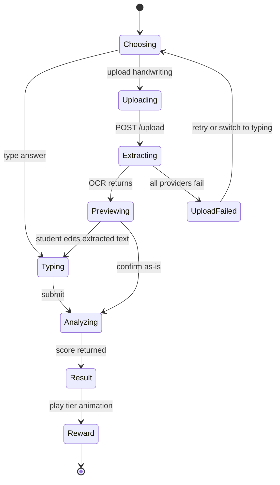

# Frontend Architecture

> **Revision 2.4** — the reward layer as designed in sprint 12: the motion
> vocabulary and why a celebration is data rather than control flow (§8.1),
> the avatar as a drawn component with expressions (§8.2), the four
> storyboards beat by beat (§8.3), the level-up banner and why it is not a
> modal (§8.4), and synthesised sound (§8.5).
>
> **Revision 2.3** — records the rest of sprint 11: the student dashboard and
> why it paints from a single aggregate (§7.2), the two-step registration the
> avatar catalogue forces, the profile/settings split, the navigation that
> moves to the bottom of a phone (§10), and the student-safe rubric the
> composer and the settings page read instead of hardcoding the weights.
>
> **Revision 2.2** — records the practice loop as built in sprint 11: the
> chart layer and why its colours are resolved at runtime (§7.1), the
> submission-per-input-method rule the composer is built around, and the
> result screen's split between what the submission carries and what only the
> `analyze` reply does.
>
> **Revision 2.1** — records the foundation as built in sprint 10: the
> generated API types, the refresh-and-retry client, and why route
> protection runs in the browser rather than in middleware.

## 1. Overview

A **Next.js 15** application (App Router) in **TypeScript**, styled with
**Tailwind CSS** and **shadcn/ui**, animated with **Framer Motion** and
**Lottie**, charting with **Chart.js**. It talks to the backend only through the
REST API of [04-api-design.md](./04-api-design.md).

## 2. Folder structure

```
frontend/
├── app/
│   ├── page.tsx                       # Landing
│   ├── (auth)/login, register, forgot-password, reset-password
│   ├── (student)/dashboard
│   ├── (student)/practice, practice/[graphId]
│   ├── (student)/submissions/[submissionId]  # Result + reward animation
│   ├── (student)/leaderboard, achievements
│   ├── (teacher)/teacher/{dashboard,submissions,submissions/[submissionId],graphs,vocabulary,analytics}
│   ├── (admin)/admin/users
│   ├── profile, settings
│   ├── globals.css                    # The palette; there is no tailwind.config
│   ├── providers.tsx                  # Query client, theme, auth
│   └── layout.tsx, error.tsx, not-found.tsx
├── components/
│   ├── ui/                            # shadcn primitives
│   ├── charts/                        # Chart.js wrappers
│   ├── practice/                      # Editor, upload, OCR preview
│   ├── results/                       # Score, feedback, highlighted answer
│   ├── gamification/                  # Tier celebrations, particles, XP bar, level-up
│   ├── dashboard/                     # Hero, stat tiles, trend, recent work
│   ├── auth/                          # Route guard, role gate, auth shell, registration
│   ├── avatars/                       # The drawn character, and the catalogue picker
│   ├── achievements/                  # The catalogue and its cards
│   ├── profile/, settings/            # Identity; appearance and security
│   ├── motion/                        # Stage, reveal, count-up
│   ├── theme/, layout/, teacher/
├── lib/
│   ├── api/                           # Typed client, one module per resource
│   ├── auth/                          # Token store, context, role helpers
│   ├── charts/                        # Palette resolution, normalisation, config
│   ├── hooks/                         # Debounce, reduced motion, the rubric
│   ├── motion/                        # Durations, curves, storyboards, the sequence hook
│   ├── sound/                         # Synthesised cues, muted by default
│   ├── results/                       # Highlight offsets → segments
│   ├── text/                          # Word counting, matching the server's rule
│   ├── format.ts                      # Figures and dates, with the em-dash rule
│   ├── nav.ts                         # One link list, two navigations
│   └── utils.ts
├── scripts/generate-api-types.mjs     # OpenAPI → types/api.ts
├── tests/                             # Vitest
└── types/api.ts                       # Generated — do not edit
```

Route groups (`(student)`, `(teacher)`) organise the tree without appearing in
the URL: `app/(student)/dashboard` serves `/dashboard`.

## 3. Rendering strategy

| Surface | Approach | Why |
|---|---|---|
| Landing | Server Component, static | Public, cacheable, SEO |
| Auth pages | Client | Form state and validation |
| Dashboard | Server shell + client widgets | Data fetched server-side; charts need the browser |
| Practice page | Client | Chart.js, editor state, autosave, upload |
| Result page | Client | Animation sequencing and audio |
| Leaderboard | Server, short revalidate | Matches the materialisation cadence |
| Teacher tables | Client | Filtering, sorting, pagination |

Default to Server Components; opt into Client Components only for
interactivity, browser APIs or animation.

## 4. Design system

| Token | Role |
|---|---|
| Primary | Purple |
| Secondary | Blue |
| Accent | Gold — reserved for crown tier, XP and level-ups |
| Tier colours | Crown gold · Flower rose · Steady sky · Hammer amber |

Gold is deliberately reserved. If it appears on ordinary buttons, the crown
reward loses the visual distinction that makes it feel earned. This is why
`--gold` is **not** shadcn's `--accent`: shadcn spends `accent` on hover and
focus surfaces, which would put gold on every menu item. `--accent` stays a
neutral surface tint, and a test fails the build if a gold utility appears
outside the reward components.

Every colour is a CSS custom property defined for both light and dark themes
(NFR-4.2); no component hardcodes a hex value.

## 5. State management

- **Server state** — fetched in Server Components where possible; TanStack Query
  for client-side fetching, caching and invalidation.
- **UI state** — local `useState`. No global store is introduced without a
  demonstrated cross-tree need.
- **Auth state** — access token in memory (`lib/auth/token-store.ts`), never in
  `localStorage` and never in a readable cookie: both are readable by any script
  on the page, so one XSS bug becomes a stolen token. The refresh token is an
  `HttpOnly` cookie the client cannot read. The cost is that a hard refresh
  starts with no access token, which is what the provider's bootstrap refresh
  is for.
- **Reward sequence** — a dedicated state machine (`idle → entering → peak →
  settling → done`), because a sequence with sound, particles and a skip control
  is not expressible as a pile of booleans without race conditions.

## 6. API client

One typed module per resource under `lib/api/`, over a shared fetch wrapper that
centralises the base URL, auth header, error-envelope parsing and refresh
retry. Components never call `fetch` directly, so the API contract has exactly
one representation in the codebase.

### 6.1 Types are generated, not transcribed

`types/api.ts` is rendered from the backend's OpenAPI document by
`scripts/generate-api-types.mjs`. A hand-copied mirror of 109 models drifts the
first time a field is renamed, and the symptom is a runtime `undefined` rather
than a compile error. CI regenerates the file against the live document and
fails if the committed copy differs, so drift is a red build instead of a bug
report.

### 6.2 The 401 retry

On a `401` for an authenticated request the client refreshes once, replays the
request with the new token, and gives up if that is refused too. Three rules
make it safe:

1. **One refresh at a time.** A dashboard fires several requests together; if
   the token expired they all return `401` at once. Refreshing per request
   would rotate the refresh token several times, and the backend treats a
   second use of a rotated token as theft — revoking the whole session family
   and signing the student out for loading a page.
2. **Exactly one retry.** A token refused twice will be refused a third time.
3. **Only a session that existed can end.** The "you have been signed out"
   handler fires only when there *was* an access token. The landing page's
   bootstrap refresh is expected to fail for a visitor who has never signed in,
   and must not bounce them to `/login`.

A dropped connection during the refresh keeps the token: a lift is not a
revoked session.

### 6.3 Errors

Everything the API can refuse arrives in one envelope, so one `ApiError` class
is honest rather than optimistic. It carries the status, the server's code and
the server's message — shown as written, because "Submission not found, or you
do not have access to it" says something a generic "Not found" does not — plus
`fieldErrors` for a 422's per-field messages and `retryAfterSeconds` for a 429.
A request that never reached a server is a `NetworkError` instead, because the
two need opposite advice.

### 6.4 Route protection

The guard is a client component (`components/auth/protected.tsx`), not
middleware. Both credentials are unavailable to a Next server: the access token
lives in memory in the tab, and the refresh cookie belongs to the API's origin,
so a split deployment never sends it to the frontend's host. Middleware could
only guess.

This is not the security boundary. Every endpoint demands a token and checks the
role server-side, and the backend's API-surface test proves it for all 75
operations; a guard that failed open here would leak a layout, not a record.

Two behaviours are deliberate:

- An anonymous visitor is redirected to `/login?next=…`, so signing in resumes
  what they were doing. Only same-site paths are honoured — an absolute `next`
  would make the login page an open redirect.
- A **wrong role is a dead end, not a redirect**: the page says so and offers
  the way back. Bouncing a student off a teacher URL leaves them wondering
  whether they mistyped.

## 7. The practice flow



`Previewing` is a real state the student acts on, not a spinner — FR-4.7
requires the extraction to be editable before analysis.

Three things about the implementation are not obvious from the diagram.

**A submission exists per input method, not per visit.** `input_method` is
fixed when a submission is opened and never flips, so switching between the
typed and handwriting tabs cannot move an attempt between them: each opens its
own submission lazily, the first time there is something to save.
`UploadFailed → Choosing` therefore continues *that* submission — "type it
instead" lives inside the handwriting tab — and the record still shows that
handwriting was attempted and did not read.

**Drafts are resumed rather than duplicated.** The API reuses a draft only
while it is pristine, so the workspace reads the open attempts on the graph
once and adopts them. Without that, writing two paragraphs and reloading would
silently start a second attempt and abandon the first.

**`Analyzing` shows no progress bar.** Marking is one request with nothing to
report. A bar that fills on a timer is a claim about a duration nobody knows,
and it reads as broken the moment it fills and waits.

### 7.1 The chart layer

Chart.js paints onto a canvas, and a canvas cannot read `var(--chart-1)`. A
literal in a component would be invisible to the theme — the same colour on a
dark ground, where the light-theme purple is unreadable — and
`tests/design-tokens.test.ts` fails the build for one. So the token is resolved
at runtime by painting it into a 1×1 canvas and reading the pixel back: the
value still comes from `globals.css`, and what reaches Chart.js is plain sRGB
it can derive a fill and a hover state from.

The chart is rebuilt, not mutated, on a theme change: every colour in the
configuration is a resolved token and half of them sit inside nested plugin
options, so patching each one is how a tooltip keeps the previous theme's
border. Controllers are registered per graph type rather than through
`chart.js/auto`, and the module is imported dynamically, so the library is not
in the first load of any route.

The y-axis is deliberately **not** forced to zero. A series moving between 230
and 250 flattens into a straight line against a zero baseline, and describing
exactly that movement is the exercise. Gaps are not spanned either: joining
across a missing reading draws a value nobody measured.

### 7.2 The dashboard

One request paints the whole screen. `GET /users/me/dashboard` is an aggregate
for exactly this reason: six requests would show the XP bar, the streak, the
chart and the activity list arriving at different moments, which reads as a
page failing rather than one loading.

Three rules the screen has to hold, each of which a well-meaning refactor
undoes:

1. **A missing average is an em dash, never a zero.** The API is careful to
   send `null` for a student who has not been marked; a `?? 0` anywhere
   between there and the screen turns "no mark" into a mark of zero.
2. **A student with no marked work gets a different screen**, not the same one
   with zeroes in it — the three steps of the loop and one way into it.
3. **The tier spread belongs here and on no shared surface.** FR-7.6 is about
   a hammer count published beside someone's name; on their own dashboard it
   is the shape of their progress.

The trend reuses the practice loop's chart layer by handing it synthetic
`chart_data`, so §7.1 applies to it unchanged. Its x-axis is the days the
student practised, not a calendar: the API zero-fills nothing, so two adjacent
points can be a day or a month apart, and the card says so — a fortnight's gap
drawn adjacent otherwise reads as an overnight drop.

### 7.3 Registration, and the rubric a student may read

Registration is two steps because the avatar catalogue is authenticated: which
avatars exist depends on the student's gender and which are unlocked depends
on their level, so there is nothing to show before the account exists. Step one
creates the account and signs them in; step two is genuinely skippable, since
registration has already assigned the default avatar for their gender
(FR-2.2). There is no Back button from step two — the account exists by then,
and a control that could only lie about what it would undo is worse than the
step indicator that replaces it.

Client-side validation mirrors the server's rules field for field and is a
courtesy, never a control. The password is measured in **bytes**, because the
server's 72 is bcrypt's byte limit; counting characters would reject passwords
from exactly the students whose languages need more than one byte a letter.

The composer's length guide and the settings page's "how your work is marked"
both read `GET /analysis/rubric` — the weights and the word-count band, and
nothing else. They are deployment configuration, so a constant in a component
is a copy that goes on claiming a rubric the server has stopped applying. The
guide never blocks: writing long costs marks on one of four writing components
and nothing else, so a hard limit would enforce a rule the marker does not
have. The public landing page states no percentage at all, because it has no
token with which to read one.

Profile and settings are two pages because they answer two questions —
identity, and how the app behaves and how the account is secured. Settings
carries no sound control: sound is muted by default and nothing plays it until
§8 lands, and a switch that toggles nothing reads as broken audio rather than
as a sprint boundary.

## 8. Reward animations

### 8.1 The motion system

One vocabulary, in `lib/motion/tokens.ts`, so that every movement in the
product is recognisably the same hand. Four durations (`quick` 0.18s, `base`
0.34s, `settle` 0.6s, `beat` 0.9s), one standard ease, one spring for arrivals
and one anticipation curve reserved for the hammer. A component that wants a
number not on this list is describing a movement GraphMaster does not make.

Sequences are **data, not control flow**. A tier celebration is an ordered list
of beats — `{ id, at }` — and a hook advances an index against the clock. Three
things fall out of that shape rather than having to be remembered:

- **Skip** jumps the index to the last beat, which *is* the settled state.
- **Replay** resets the index to zero.
- **`prefers-reduced-motion` starts at the last beat**, so the reduced-motion
  render is the same component in its final frame, not a separate card that
  can drift out of step with what everyone else sees.

And it makes FR-7.7 testable: a test reads the hammer storyboard and asserts
that its final two beats are the recovery and the encouragement. There is no
code path that ends the sequence earlier, because there is no code path at all
— only a list.

### 8.2 The avatar

The avatar is a **component keyed by the avatar's `code`**, not an ``
pointed at `image_url`. A reaction needs an expression, an expression needs
artwork per state, and a single flat image has one. The component draws the
character from token-coloured shapes and takes an `expression` prop
(`neutral`, `happy`, `cheer`, `dizzy`, `determined`), so it themes with the
rest of the interface and can be posed.

It is stylised rather than realistic: a duotone illustration in the product's
own purple has no skin tone to get wrong, which for a platform used by one
cohort after another is the right default rather than a compromise.

`image_url` remains the API's own field and is untouched; the client simply
does not need it for a character it can draw.

### 8.3 The four storyboards

Timings are seconds from the start of the sequence. Every one ends on a beat
whose frame is the still card.

**Crown — "Coronation" (2.6s)**

| At | Beat | What moves |
|---|---|---|
| 0.00 | `arrive` | Card scales 0.96 → 1; avatar rises 16px; expression `happy` |
| 0.35 | `crown` | Crown falls from −70px, overshoots, settles; avatar squashes 4% on impact; expression `cheer` |
| 0.85 | `sparkle` | Six sparkles radiate outward, 40ms apart, fading over 0.9s |
| 1.25 | `confetti` | Twenty-four pieces burst up and out, then fall under gravity |
| 1.60 | `title` | The server's headline — "Graph King" / "Graph Queen" — springs in |
| 2.60 | `settled` | The still card |

**Flower — "Bloom" (1.9s)**

| At | Beat | What moves |
|---|---|---|
| 0.00 | `arrive` | As above; expression `happy` |
| 0.30 | `bloom` | Five petals scale 0 → 1 from the flower's centre, 60ms apart; the seed pops last |
| 0.80 | `spin` | The whole flower turns 22° and settles; the avatar hops once; expression `cheer` |
| 1.20 | `title` | "Rising Writer" |
| 1.90 | `settled` | The still card |

**Steady — "Steady on" (1.6s)**

| At | Beat | What moves |
|---|---|---|
| 0.00 | `arrive` | As above |
| 0.30 | `pulse` | Two concentric rings expand from the character and fade |
| 0.70 | `nod` | The avatar nods once; expression `happy` |
| 1.10 | `title` | "Steady Learner" |
| 1.60 | `settled` | The still card |

**Hammer — "Bonk, and back up" (3.0s)**

| At | Beat | What moves |
|---|---|---|
| 0.00 | `arrive` | Avatar centred, expression `neutral` |
| 0.25 | `swing` | An oversized cartoon hammer swings in from the top right, −65° → −35° |
| 0.55 | `bonk` | Contact. The avatar squashes 14% and dips 8px; the hammer rebounds past vertical |
| 0.75 | `dizzy` | Expression `dizzy`; three stars orbit clear of the head |
| 1.30 | `wobble` | The avatar tips 12° and sinks 10px — knocked off balance, **not** knocked down |
| 1.70 | `recover` | Springs upright with a 8% overshoot; expression `determined` |
| 2.20 | `message` | "Keep Practicing!", in the server's own words |
| 3.00 | `settled` | The still card |

The hammer storyboard is the one with rules attached, and they are design
constraints rather than notes:

1. **The hammer is impossible.** Oversized, comic, and it rebounds further
   than it fell. A hammer with plausible mass reads as violence; a weightless
   one reads as slapstick.
2. **`wobble` is 0.4s and 10px.** The character is never prone, never leaves
   the frame, and never lies still. The beat exists to give the recovery
   something to answer, and a longer one turns the joke on the student.
3. **`recover` and `message` are the last two beats before the settled frame.**
   Skipping lands on the settled frame; reduced motion renders it directly.
   Both paths therefore end recovered, by construction.
4. **The words are the server's**, and they do not wait for the animation.
   `feedback.message` — which always opens with the encouragement (FR-7.7) —
   is in the DOM from the first frame, below the stage. The sequence reveals
   the *title card*; it never gates the sentence. A student whose tab is
   throttled in the background, who navigates away at 1.2 seconds, or who is
   using a screen reader has been told exactly what everyone else was told.
5. **It is never shown to anyone else.** A tier lives on the student's own
   result and dashboard. The leaderboard has XP and level and no tier at all.

### 8.4 The level-up moment

A **banner, not a modal**. A dialog over a result steals focus from the thing
the student came to read and has to be dismissed before the feedback can be
seen; the moment it celebrates is a side effect of work already displayed on
the same screen. The banner arrives above the award summary, announces itself
once through a live region, and stays — so a student who looks away does not
miss it, which is the actual failure mode of a self-dismissing dialog.

The XP bar fills to full, sweeps gold, and refills at the new level's
position. The count-up shares `CountUp` with the dashboard, so the number
behaves the same way in both places.

### 8.5 Sound

Muted by default (FR-7.11), stored per browser, and never started without a
gesture — browsers block unprompted audio anyway, so an unmuted default would
fail inconsistently rather than loudly.

Cues are **synthesised**, not files: short envelopes over an oscillator, built
the first time a student enables sound. A celebration that has to download an
asset before it can play arrives after the moment it was for, and a reward
system whose assets can 404 is worse than a silent one.

Sound and motion are separate preferences. A student who has asked their
system to stop animating has not asked it to be quiet, and the reverse is at
least as common.

## 9. The teaching surfaces

The staff half of the product is not a loop. A teacher opens it between
lessons with one question — *who needs me, and what do I say to them* — and
every decision below follows from answering that before anything else.

The design record, with wireframes and the tradeoffs, is
[`docs/proposals/sprint-13-teaching-surfaces.md`](../proposals/sprint-13-teaching-surfaces.md).

### 9.1 The attention signal

`lib/insights/attention.ts` derives who needs the teacher from the roster
`GET /analytics/class/{id}` already returns. There is no endpoint for it and
none was added: the thresholds are pedagogical judgements a deployment may
want to differ on, and isolating them in one tested pure module is cheaper
than a migration.

| Group | Rule | Ordered by |
|---|---|---|
| Not started | `submission_count === 0` | Name |
| Finding it hard | `average_final_score !== null && < 50` | Lowest average first |
| Gone quiet | Nothing marked for ≥ 7 days | Longest silence first |

A student matches the first group they qualify for and appears once. `50` is
the platform's own practice-tier boundary, not a second threshold. And the
`null` guard is explicit because `null < 50` is `true` in JavaScript — without
it, every student who has not started is described as one who scored badly.

### 9.2 The card contract

Every analytics section is an `InsightCard`: a question, an answer, and an
interpretation. The interpretation is derived in `lib/insights/narrate.ts` and
is never written by hand — the same discipline `app/nlp/feedback.py` applies to
a student. It refuses a direction from fewer than four buckets of marked work,
measures participation against enrolment, and describes the tier spread as
*attempts* rather than as students.

Grids of these use `items-start`. A card holding one sentence beside one
holding a list of eight would otherwise stretch to match it, and the emptier
the finding the larger the hole.

### 9.3 Absence, drawn honestly

`GET /analytics/trends` groups by bucket, so a day nobody submitted produces
**no row at all** rather than a zero. `lib/charts/series.ts` expands the rows
onto the calendar the teacher asked for and leaves `null` where nothing was
marked; the existing `spanGaps: false` then breaks the line. The card says how
many buckets were empty, because a reader who assumes an unbroken calendar
reads the break as a fault.

`Sparkline` does the same in forty pixels, with one SVG subpath per run of
known values.

### 9.4 Invariants as affordances

| Rule | How it appears |
|---|---|
| A graph needs ≥1 required target term to publish | Publish disabled, reason on the card, target picker beside it |
| Vocabulary is soft-deleted | "Deactivate", deactivated terms still listed behind a switch, "Reactivate" in the row |
| `is_phrase` is derived | A badge, never a control |
| A hand-set lemma is not re-derived | The form says so when the term changes |
| Excel and PDF are optional | Formats disabled from `GET /reports/capabilities` |
| A submission export carries no answers | Stated on the dialog before the click |
| A leaderboard never publishes a tier | Asserted by a test reading the rendered text |

### 9.5 Two presentations, not one compromise

Dense staff data is a list of cards below `md` and a table at `md` and above —
the queue, the vocabulary manager and the user list all ship both. A table at
390px is horizontal scroll; cards on a wide monitor throw away the
column-to-column comparison the screen exists for.

## 10. Accessibility (NFR-4.3 – NFR-4.6)

- Semantic landmarks and a skip link on every page.
- Full keyboard operability; visible focus rings; focus trapped in modals and
  restored on close.
- Charts carry an accessible data table alternative — possible only because
  charts are structured data rather than images
  ([02-database-schema.md](./02-database-schema.md) §3.2).
- Score results are announced via a live region, so a screen-reader user gets
  the outcome without seeing the animation.
- AA contrast verified in both themes, including tier colours.
- Reward tiers are distinguished by icon and text, never by colour alone.
- Attention groups are named in words; the dot beside each repeats the label and
  carries nothing on its own.
- The podium's DOM order is 1, 2, 3; only CSS `order` centres first place, so a
  screen reader and the tab sequence receive the ranking in rank order.
- Changing a class or a period announces the resulting figures politely —
  otherwise a keyboard user's only feedback is numbers they cannot see moving.
- Every button is at least 44px until `sm:`, where a pointer is the likely
  input.

## 11. Responsiveness

Mobile-first, 320 px to 2560 px (NFR-4.1).

The header's links are hidden below `md` — there is no room beside the logo —
so on a phone they move to a fixed bar at the bottom of the screen. Both
navigations render the same list from `lib/nav.ts`: two copies drift, and the
drift is invisible on exactly the device whose users were not asked. The bar
pads for `env(safe-area-inset-bottom)`, without which its targets sit under
the home indicator's gesture area and every second tap is swallowed.

The practice page is the hard case:
chart and editor sit side by side on desktop and stack on mobile with the chart
collapsible, so a phone user is not scrolling past a chart to reach the textarea
on every keystroke. Handwriting upload accepts the device camera directly, which
is the likeliest way a student submits.

## 12. Performance

- Reward animation components are dynamically imported — Lottie and the confetti
  library are large, and no one needs them before a result exists.
- Chart.js is imported per chart type rather than wholesale.
- Fonts are self-hosted with `display: swap`.
- Server Components keep the client bundle to what genuinely needs interactivity,
  supporting the 2-second first paint of NFR-1.5.

## 13. Testing

Vitest with jsdom, under `tests/`. The suite covers the foundation's risky
parts rather than aiming at a coverage number:

| Suite | What it holds down |
|---|---|
| `api-client` | Query building, the bearer header, multipart passthrough, envelope parsing, the single-flight refresh and all four of its edge cases |
| `token-store` | The token never reaches server-side module state, where it would be shared between users |
| `auth-context` | Bootstrap from the cookie, a visitor with no cookie, and a sign-out the server refuses |
| `protected` | No flash of a protected page, the `next` round trip, and the wrong-role dead end |
| `redirect` | `next` is attacker-controlled: absolute, protocol-relative and `javascript:` values are refused |
| `design-tokens` | Every colour is defined for both themes; no hardcoded hex outside `globals.css`; gold appears only where it is allowed |

`design-tokens` is the frontend's counterpart to the backend's API-surface
test: the rule is a list in the test file, and relaxing it means adding a line
with a reason.

## 14. Continuous integration

The `frontend` job runs Prettier, ESLint, a production build, `tsc --noEmit`
and the tests, in that order — the build comes before the typecheck because it
generates `next-env.d.ts`. The `contract` job regenerates `types/api.ts` from
the live OpenAPI document and fails on any diff. `docker.yml` builds the image,
boots it, and checks that `NEXT_PUBLIC_API_URL` actually reached the client
bundle — a variable set on the container instead of at build time is silently
absent, and every browser falls back to its own localhost.
