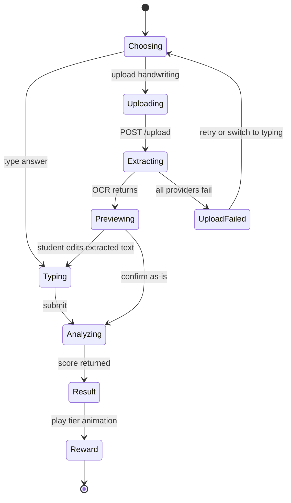

# Frontend Architecture

> **Revision 2.1** — records the foundation as built in sprint 10: the
> generated API types, the refresh-and-retry client, and why route
> protection runs in the browser rather than in middleware.

## 1. Overview

A **Next.js 15** application (App Router) in **TypeScript**, styled with
**Tailwind CSS** and **shadcn/ui**, animated with **Framer Motion** and
**Lottie**, charting with **Chart.js**. It talks to the backend only through the
REST API of [04-api-design.md](./04-api-design.md).

## 2. Folder structure

```
frontend/
├── app/
│   ├── page.tsx                       # Landing
│   ├── (auth)/login, register
│   ├── (student)/dashboard
│   ├── (student)/practice, practice/[graphId]
│   ├── (student)/submissions/[id]     # Result + reward animation
│   ├── (student)/leaderboard, achievements
│   ├── (teacher)/teacher/{dashboard,students,submissions,graphs,vocabulary,analytics,reports}
│   ├── (admin)/admin/{users,classes,analytics}
│   ├── profile, settings
│   ├── globals.css                    # The palette; there is no tailwind.config
│   ├── providers.tsx                  # Query client, theme, auth
│   └── layout.tsx, error.tsx, not-found.tsx
├── components/
│   ├── ui/                            # shadcn primitives
│   ├── charts/                        # Chart.js wrappers
│   ├── practice/                      # Editor, upload, OCR preview
│   ├── gamification/                  # Avatar, rewards, XP bar, badges
│   ├── auth/                          # Route guard and role gate
│   ├── theme/, layout/, dashboard/, teacher/
├── lib/
│   ├── api/                           # Typed client, one module per resource
│   ├── auth/                          # Token store, context, role helpers
│   └── utils.ts
├── scripts/generate-api-types.mjs     # OpenAPI → types/api.ts
├── tests/                             # Vitest
└── types/api.ts                       # Generated — do not edit
```

Route groups (`(student)`, `(teacher)`) organise the tree without appearing in
the URL: `app/(student)/dashboard` serves `/dashboard`.

## 3. Rendering strategy

| Surface | Approach | Why |
|---|---|---|
| Landing | Server Component, static | Public, cacheable, SEO |
| Auth pages | Client | Form state and validation |
| Dashboard | Server shell + client widgets | Data fetched server-side; charts need the browser |
| Practice page | Client | Chart.js, editor state, autosave, upload |
| Result page | Client | Animation sequencing and audio |
| Leaderboard | Server, short revalidate | Matches the materialisation cadence |
| Teacher tables | Client | Filtering, sorting, pagination |

Default to Server Components; opt into Client Components only for
interactivity, browser APIs or animation.

## 4. Design system

| Token | Role |
|---|---|
| Primary | Purple |
| Secondary | Blue |
| Accent | Gold — reserved for crown tier, XP and level-ups |
| Tier colours | Crown gold · Flower rose · Steady sky · Hammer amber |

Gold is deliberately reserved. If it appears on ordinary buttons, the crown
reward loses the visual distinction that makes it feel earned. This is why
`--gold` is **not** shadcn's `--accent`: shadcn spends `accent` on hover and
focus surfaces, which would put gold on every menu item. `--accent` stays a
neutral surface tint, and a test fails the build if a gold utility appears
outside the reward components.

Every colour is a CSS custom property defined for both light and dark themes
(NFR-4.2); no component hardcodes a hex value.

## 5. State management

- **Server state** — fetched in Server Components where possible; TanStack Query
  for client-side fetching, caching and invalidation.
- **UI state** — local `useState`. No global store is introduced without a
  demonstrated cross-tree need.
- **Auth state** — access token in memory (`lib/auth/token-store.ts`), never in
  `localStorage` and never in a readable cookie: both are readable by any script
  on the page, so one XSS bug becomes a stolen token. The refresh token is an
  `HttpOnly` cookie the client cannot read. The cost is that a hard refresh
  starts with no access token, which is what the provider's bootstrap refresh
  is for.
- **Reward sequence** — a dedicated state machine (`idle → entering → peak →
  settling → done`), because a sequence with sound, particles and a skip control
  is not expressible as a pile of booleans without race conditions.

## 6. API client

One typed module per resource under `lib/api/`, over a shared fetch wrapper that
centralises the base URL, auth header, error-envelope parsing and refresh
retry. Components never call `fetch` directly, so the API contract has exactly
one representation in the codebase.

### 6.1 Types are generated, not transcribed

`types/api.ts` is rendered from the backend's OpenAPI document by
`scripts/generate-api-types.mjs`. A hand-copied mirror of 109 models drifts the
first time a field is renamed, and the symptom is a runtime `undefined` rather
than a compile error. CI regenerates the file against the live document and
fails if the committed copy differs, so drift is a red build instead of a bug
report.

### 6.2 The 401 retry

On a `401` for an authenticated request the client refreshes once, replays the
request with the new token, and gives up if that is refused too. Three rules
make it safe:

1. **One refresh at a time.** A dashboard fires several requests together; if
   the token expired they all return `401` at once. Refreshing per request
   would rotate the refresh token several times, and the backend treats a
   second use of a rotated token as theft — revoking the whole session family
   and signing the student out for loading a page.
2. **Exactly one retry.** A token refused twice will be refused a third time.
3. **Only a session that existed can end.** The "you have been signed out"
   handler fires only when there *was* an access token. The landing page's
   bootstrap refresh is expected to fail for a visitor who has never signed in,
   and must not bounce them to `/login`.

A dropped connection during the refresh keeps the token: a lift is not a
revoked session.

### 6.3 Errors

Everything the API can refuse arrives in one envelope, so one `ApiError` class
is honest rather than optimistic. It carries the status, the server's code and
the server's message — shown as written, because "Submission not found, or you
do not have access to it" says something a generic "Not found" does not — plus
`fieldErrors` for a 422's per-field messages and `retryAfterSeconds` for a 429.
A request that never reached a server is a `NetworkError` instead, because the
two need opposite advice.

### 6.4 Route protection

The guard is a client component (`components/auth/protected.tsx`), not
middleware. Both credentials are unavailable to a Next server: the access token
lives in memory in the tab, and the refresh cookie belongs to the API's origin,
so a split deployment never sends it to the frontend's host. Middleware could
only guess.

This is not the security boundary. Every endpoint demands a token and checks the
role server-side, and the backend's API-surface test proves it for all 75
operations; a guard that failed open here would leak a layout, not a record.

Two behaviours are deliberate:

- An anonymous visitor is redirected to `/login?next=…`, so signing in resumes
  what they were doing. Only same-site paths are honoured — an absolute `next`
  would make the login page an open redirect.
- A **wrong role is a dead end, not a redirect**: the page says so and offers
  the way back. Bouncing a student off a teacher URL leaves them wondering
  whether they mistyped.

## 7. The practice flow



`Previewing` is a real state the student acts on, not a spinner — FR-4.7
requires the extraction to be editable before analysis.

## 8. Reward animations

| Tier | Sequence |
|---|---|
| Crown | Avatar celebrates → crown descends and settles → sparkle particles → confetti burst → victory sound → title card "Graph King"/"Graph Queen" |
| Flower | Flower blooms and rotates → avatar cheers → positive chime → "Rising Writer" |
| Steady | Encouraging pulse → avatar nods → soft chime → "Steady Learner" |
| Hammer | Cartoon hammer falls → bonk → dizzy stars → brief fall → **recovery** → "Keep Practicing! You Can Improve!" |

Rules enforced in the components themselves, not left to the designer's
discretion:

1. **Every sequence is skippable and replayable** (FR-7.9).
2. **Sound is muted until opted in** (FR-7.11).
3. **`prefers-reduced-motion` collapses any sequence to a static card** carrying
   the same message (FR-7.10) — the information is never only in the motion.
4. **The hammer always ends in recovery.** The component has no code path that
   leaves the avatar down; recovery is inside the sequence, not a follow-up.

## 9. Accessibility (NFR-4.3 – NFR-4.6)

- Semantic landmarks and a skip link on every page.
- Full keyboard operability; visible focus rings; focus trapped in modals and
  restored on close.
- Charts carry an accessible data table alternative — possible only because
  charts are structured data rather than images
  ([02-database-schema.md](./02-database-schema.md) §3.2).
- Score results are announced via a live region, so a screen-reader user gets
  the outcome without seeing the animation.
- AA contrast verified in both themes, including tier colours.
- Reward tiers are distinguished by icon and text, never by colour alone.

## 10. Responsiveness

Mobile-first, 320 px to 2560 px (NFR-4.1). The practice page is the hard case:
chart and editor sit side by side on desktop and stack on mobile with the chart
collapsible, so a phone user is not scrolling past a chart to reach the textarea
on every keystroke. Handwriting upload accepts the device camera directly, which
is the likeliest way a student submits.

## 11. Performance

- Reward animation components are dynamically imported — Lottie and the confetti
  library are large, and no one needs them before a result exists.
- Chart.js is imported per chart type rather than wholesale.
- Fonts are self-hosted with `display: swap`.
- Server Components keep the client bundle to what genuinely needs interactivity,
  supporting the 2-second first paint of NFR-1.5.

## 12. Testing

Vitest with jsdom, under `tests/`. The suite covers the foundation's risky
parts rather than aiming at a coverage number:

| Suite | What it holds down |
|---|---|
| `api-client` | Query building, the bearer header, multipart passthrough, envelope parsing, the single-flight refresh and all four of its edge cases |
| `token-store` | The token never reaches server-side module state, where it would be shared between users |
| `auth-context` | Bootstrap from the cookie, a visitor with no cookie, and a sign-out the server refuses |
| `protected` | No flash of a protected page, the `next` round trip, and the wrong-role dead end |
| `redirect` | `next` is attacker-controlled: absolute, protocol-relative and `javascript:` values are refused |
| `design-tokens` | Every colour is defined for both themes; no hardcoded hex outside `globals.css`; gold appears only where it is allowed |

`design-tokens` is the frontend's counterpart to the backend's API-surface
test: the rule is a list in the test file, and relaxing it means adding a line
with a reason.

## 13. Continuous integration

The `frontend` job runs Prettier, ESLint, a production build, `tsc --noEmit`
and the tests, in that order — the build comes before the typecheck because it
generates `next-env.d.ts`. The `contract` job regenerates `types/api.ts` from
the live OpenAPI document and fails on any diff. `docker.yml` builds the image,
boots it, and checks that `NEXT_PUBLIC_API_URL` actually reached the client
bundle — a variable set on the container instead of at build time is silently
absent, and every browser falls back to its own localhost.
