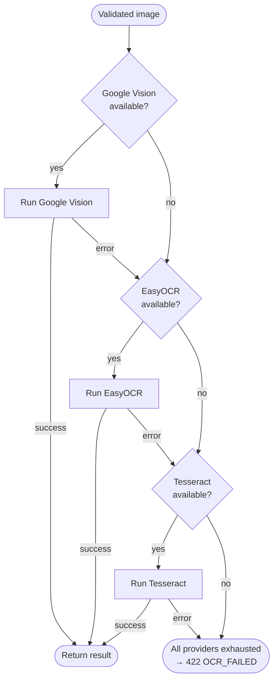
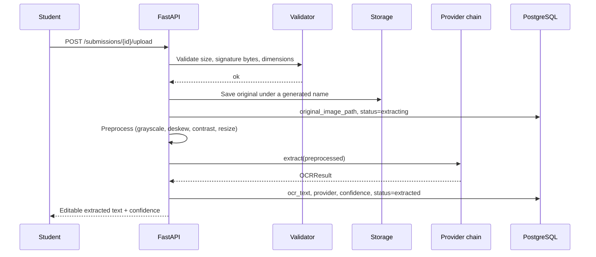

# OCR Architecture

> **Revision 2.0** — the target of OCR has changed. Revision 1.0 ran OCR against
> the *graph prompt image* to read axis labels. The specification requires OCR
> against the *student's handwritten answer*. This document is rewritten
> accordingly.

## 1. Purpose

Students may answer by photographing handwriting instead of typing (FR-3.6).
The OCR subsystem turns that photograph into text the analysis engine can score,
and — critically — hands the result back to the student for correction before
anything is scored (FR-4.6, FR-4.7).

OCR runs **once per submission**, not per graph. There is nothing to cache: every
upload is a different student's handwriting.

## 2. Why the extracted text is editable

Handwriting OCR is not reliable enough to score blind. A misread word directly
costs the student vocabulary credit, and the term most likely to be misread is
often the very term being assessed — "fluctuate" is a harder read than "the".

Making the extraction editable turns an accuracy problem into a UX step:
the machine does the tedious transcription, the student confirms it. The system
records both the raw `ocr_text` and the confirmed `answer_text`, plus a
`was_ocr_edited` flag, which also yields a genuine research dataset on OCR
accuracy for handwritten academic English.

This is why analysis is a **separate, explicit call** rather than a continuation
of the upload.

## 3. Provider chain

The specification names a preference order: Google Vision, then EasyOCR, then
Tesseract. Each is wrapped behind a common interface.

```python
class OCRProvider(Protocol):
    name: str
    def is_available(self) -> bool: ...
    def extract(self, image: bytes) -> OCRResult: ...
```

`OCRResult` carries `text`, `confidence` (0.0–1.0), `provider` and
`raw_blocks`.

### 3.1 Chain behaviour



Availability is probed **once at application start**, not per request. Probing
Google Vision credentials on every upload would add a network round trip to
every submission, and the answer never changes within a process lifetime.
Runtime *errors* still fall through to the next provider — availability and
success are different questions.

### 3.2 Provider notes

| Provider | Availability condition | Notes |
|---|---|---|
| **Google Vision** | `GOOGLE_APPLICATION_CREDENTIALS` set and the client library importable | Best handwriting accuracy. Requires a billed GCP account, so it is optional; see [../PROJECT_PLAN.md](../PROJECT_PLAN.md) §3.4 |
| **EasyOCR** | Model files present in the image | **The default working path.** Models are baked into the Docker image at build time — a first-request download would blow the 10 s budget of NFR-1.3 and fail entirely on hosts without runtime egress |
| **Tesseract** | `tesseract` binary on `PATH` | Weakest on cursive handwriting; a last resort, not a peer |

The system is fully functional with **no paid services configured**.

## 4. Pipeline



### 4.1 Validation (FR-4.1 – FR-4.3)

Performed before a byte is written to storage:

1. **Size** — rejected above the configured maximum (default 10 MB) → `413`.
2. **Signature bytes** — the first bytes are checked against known magic numbers
   for JPEG (`FF D8 FF`), PNG (`89 50 4E 47`) and WEBP (`RIFF....WEBP`).
   Extensions and the client-supplied `Content-Type` are both trivially forged,
   so neither is trusted → `415`.
3. **Decodability** — the image is opened with Pillow, which rejects truncated
   and malformed files that pass a signature check.
4. **Dimensions** — images beyond a configured pixel ceiling are rejected before
   decode to prevent decompression-bomb memory exhaustion.

The stored filename is **generated**, never derived from the upload's own name,
and files are written outside any web-served directory (NFR-2.8).

### 4.2 Preprocessing

Applied to a copy; the original is always retained unmodified.

| Step | Purpose |
|---|---|
| Grayscale | Handwriting is monochrome; colour adds noise, not signal |
| Deskew | Phone photographs of paper are rarely square to the page. Applied only between 0.3° and 15°: below that, resampling softens the strokes for no gain; above it, the estimate is more likely a misdetection than a real tilt |
| Contrast normalisation | Compensates for uneven lighting and shadow across the sheet |
| Denoise | Removes paper grain and JPEG artefacts |
| Bounded resize | Caps inference cost; very large photos are downscaled to a maximum edge |

Preprocessing is skipped for Google Vision, which performs better on the
original than on an aggressively normalised image.

### 4.3 Post-processing

Raw OCR output needs cleanup before it reaches the analyser:

- Line fragments are joined into sentences; a line break mid-sentence is a
  property of the paper, not of the writing.
- Hyphenated line-end splits are rejoined (`fluctu-` + `ate` → `fluctuate`).
  Without this, a term split across two lines is silently lost from the score.
- Runs of whitespace collapse to single spaces.
- Common confusions are corrected conservatively, and only inside a single
  token whose own shape makes the intent unambiguous:
  - `0` → `o` in a mostly-alphabetic token (`s0ared` → `soared`).
  - `O`/`l`/`I` → digits in a mostly-numeric token (`2O19` → `2019`).
  - A token containing a **run** of two or more digits is left alone in the
    alphabetic direction. That guard is what protects `COVID19`, `30mm` and
    `Q1 2019` from being corrupted into words.
  - **`1` is deliberately never mapped back to a letter**, though revision 2.0
    of this document called for it. `1` is equally shaped like `l`, `I` and
    `i`, so "1ncrease" is as readily "lncrease" as "increase": the correction
    swaps one non-word for another while risking the wrong one. Disambiguating
    it needs a lexicon, which the analyser has and this layer does not, so the
    ambiguous case is passed through untouched.

Cleanup is deliberately restrained. Aggressive autocorrection risks inventing a
vocabulary term the student never wrote, which would inflate the score — a worse
failure than missing one, because the student is then rewarded for the machine's
guess.

## 5. Failure handling

| Failure | Handling |
|---|---|
| File too large | `413 FILE_TOO_LARGE`, nothing stored |
| Wrong signature | `415 UNSUPPORTED_FILE_TYPE`, nothing stored |
| Corrupt image | `415`, nothing stored |
| One provider errors | Falls through to the next; logged with the provider name |
| All providers fail | `422 OCR_FAILED`, `status='failed'`, `error_message` set. **The uploaded image is kept** (FR-4.9) so the student can retry or switch to typing without re-photographing |
| Empty extraction | `status='extracted'` with empty text and a `warning`; the student is prompted to check the photo or type instead. Not an error — a blank page is a legitimate outcome |
| Low confidence | Never blocks. The confidence is surfaced in the UI so the student knows to read the preview carefully |

## 6. Output contract

```json
{
  "text": "The line graph shows a steady increase in solar energy output...",
  "confidence": 0.8734,
  "provider": "easyocr",
  "raw_blocks": [
    {"text": "The line graph shows", "bbox": [12, 40, 380, 78], "confidence": 0.91}
  ]
}
```

`raw_blocks` are persisted for research and debugging. They are what makes it
possible, later, to answer *why* a particular word was misread rather than only
observing that the score was low.

## 7. Performance

| Provider | Typical latency (A4 page) |
|---|---|
| Google Vision | 0.8 – 2.0 s (network bound) |
| EasyOCR (CPU) | 1.5 – 4.0 s |
| Tesseract | 0.4 – 1.2 s |

All are within the 10-second budget of NFR-1.3. The EasyOCR reader is
instantiated **once at application start** and reused; constructing it per
request would add several seconds of model loading to every upload.

## 8. Implementation notes

### 8.1 The skew angle is normalised modulo 90

`cv2.minAreaRect` identifies a rectangle's orientation only up to a quarter
turn, and **which** quarter OpenCV reports has changed between major versions —
4.5+ returns `[0, 90)`, 5.0 returns `[-90, 0]`. The estimate is therefore
reduced modulo 90 into `(-45, 45]`, which yields the same correction under
either convention. A version-specific normalisation was the original
implementation and silently stopped deskewing anything on OpenCV 5; the
regression is now covered by a test that asserts the correction negates a known
rotation.

### 8.2 Optional dependencies

`opencv-python-headless`, `numpy`, `easyocr`, `pytesseract` and
`google-cloud-vision` all live in the `[ocr]` extra, and every module that uses
them imports lazily. A minimal install without the extra still boots, still
serves typed answers, and reports `operational: false` from `GET /ocr/status`;
preprocessing falls back to the Pillow-only path. This is what keeps the test
suite runnable without a multi-gigabyte model download.
