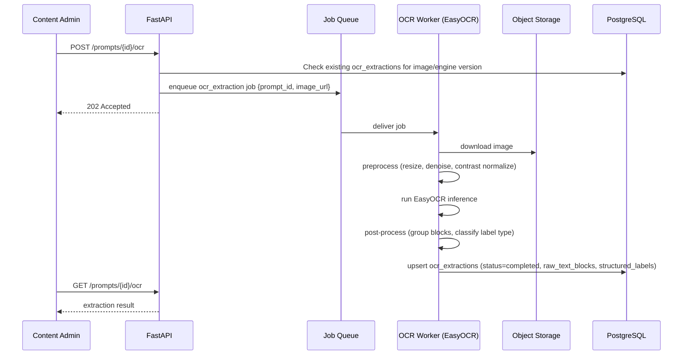

# OCR Architecture

## 1. Purpose

The OCR pipeline extracts textual information embedded in a `graph_prompt` image — chart titles, axis labels, legend entries, and data callouts — using **EasyOCR**. This extracted text is used to: (a) enrich prompt metadata for content admins, and (b) give the NLP scoring stage ([08-nlp-architecture.md](./08-nlp-architecture.md)) ground-truth labels to check whether a learner's description correctly references the chart's actual content (e.g., did they name the right axis units or time period).

OCR runs **per prompt image**, not per submission — the result is cached in `ocr_extractions` (see [02-database-schema.md](./02-database-schema.md)) and reused across every learner who answers that prompt.

## 2. Pipeline Stages



## 3. Stage Detail

### 3.1 Image Ingestion & Validation
- Worker downloads the image from object storage using the `image_url` reference on `graph_prompts`.
- Validates file type (PNG/JPEG), dimensions, and file size against configured limits before running inference, rejecting (status `failed`, `error_message` set) images that fail validation rather than passing them to the model.

### 3.2 Preprocessing
- Resize to a bounded max dimension to control inference latency/memory.
- Normalize contrast/denoise where the source image is a low-quality scan or screenshot, improving text detection accuracy on small axis-label fonts.
- No cropping/segmentation of chart regions is performed at this stage — EasyOCR runs against the full image; region classification happens in post-processing (§3.4).

### 3.3 EasyOCR Inference
- The worker invokes EasyOCR's text detection + recognition pipeline against the preprocessed image.
- Output is a list of `{text, bounding_box, confidence}` triples — stored verbatim as `ocr_extractions.raw_text_blocks` (JSONB) for traceability and re-processing without re-running inference.
- Low-confidence blocks (below a configured threshold) are retained in `raw_text_blocks` but excluded from `structured_labels` to avoid polluting downstream NLP comparisons with noisy reads.

### 3.4 Post-Processing / Structuring
- Heuristic classification of retained blocks into semantic roles based on position and text pattern:
  - **Title**: topmost, largest bounding box text
  - **Axis labels**: text aligned along the image edges
  - **Legend entries**: clustered text blocks near a color-swatch region
  - **Data callouts**: numeric text near data points/bars
- Result stored as `ocr_extractions.structured_labels` (JSONB), consumed by:
  - Content-admin tooling, to auto-suggest `graph_prompts.target_vocabulary`
  - The NLP stage, to check topical/label accuracy in a learner's description

### 3.5 Persistence
- Results are **upserted** keyed by `(graph_prompt_id, engine_version)` — idempotent against redelivered queue messages, per the at-least-once delivery model in [05-backend-architecture.md](./05-backend-architecture.md).
- `engine_version` records the EasyOCR model/version used, so a future model upgrade can be identified in the data and selectively re-run against existing prompts without ambiguity.

## 4. Output Contract

The contract consumed by the NLP stage and the frontend is the `ocr_extractions` row shape defined in [02-database-schema.md](./02-database-schema.md) §4.2:

```json
{
  "status": "completed",
  "raw_text_blocks": [
    { "text": "Renewable Energy Share (%)", "bbox": [x0, y0, x1, y1], "confidence": 0.94 }
  ],
  "structured_labels": {
    "title": "Renewable Energy Share by Country, 2010–2020",
    "axis_x": "Year",
    "axis_y": "Share (%)",
    "legend": ["Solar", "Wind", "Hydro"],
    "callouts": ["2010", "2015", "2020"]
  },
  "engine_version": "easyocr-1.7-en"
}
```

## 5. Failure & Fallback Handling

| Failure Mode | Handling |
|---|---|
| Image download fails (missing/corrupt object) | Job marked `failed`, `error_message` populated; content admin is notified via the prompt's OCR status in the admin UI |
| EasyOCR raises during inference (e.g., unsupported format) | Caught at the job-processing boundary ([05-backend-architecture.md](./05-backend-architecture.md) §7), row marked `failed` with the exception summary; job is not silently retried indefinitely — a bounded retry count is enforced by the queue |
| Low overall confidence across all blocks | Extraction still marked `completed`, but `structured_labels` may be sparse/empty; downstream NLP scoring treats missing labels as "no ground truth available" rather than an error, degrading gracefully to vocabulary-only scoring |
| EasyOCR model upgrade changes output shape | New `engine_version` written; old rows remain valid for audit/history, and re-extraction can be explicitly triggered per prompt via `POST /prompts/{id}/ocr` |

## 6. Resource & Scaling Considerations

- EasyOCR inference is CPU/GPU-intensive relative to typical API request work; the OCR worker runs as its own container so it can be scaled and resourced independently (see deployment topology in [01-system-architecture.md](./01-system-architecture.md)).
- Because OCR runs once per prompt (not per submission), sustained load is driven by content-admin authoring activity, not learner traffic volume — the worker pool can be sized modestly and scaled on queue depth rather than provisioned for peak learner concurrency.
