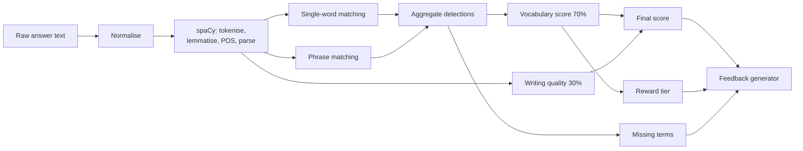

# NLP & Evaluation Architecture

> **Revision 2.0** — rewritten around the specification's 70/30 scoring model
> and the teacher-editable vocabulary library.

## 1. Purpose

The analysis engine takes a student's graph description and the target
vocabulary for that graph, and produces the vocabulary score, writing score,
final score, detected and missing term lists, reward tier and feedback stored in
`scores` ([02-database-schema.md](./02-database-schema.md) §4.3).

Built on **spaCy** (`en_core_web_sm`) for tokenisation, lemmatisation and
dependency parsing, and **NLTK** for sentence-level statistics.

## 2. Pipeline



## 3. Normalisation (FR-6.1)

1. Unicode NFKC normalisation, so curly quotes and typographic dashes do not
   fragment tokens.
2. Lowercasing.
3. Punctuation removal — except the internal hyphens and apostrophes that are
   part of a word, since stripping those would turn `bottom-out` into two
   unrelated tokens.
4. Whitespace collapsing.

The original text is never mutated; normalisation produces a parallel string,
and character offsets back into the original are preserved so detected terms can
be highlighted in the UI at their real positions.

## 4. Vocabulary detection

### 4.1 Lemma matching (FR-6.2)

Single-word terms are matched on **lemma**, not surface form. spaCy lemmatises
`increased`, `increasing`, `increases` and `increase` all to `increase`, so a
student is credited for the term regardless of the inflection they chose.

Surface matching would have failed here in a way that is easy to miss: the base
form `increase` is *less* common in real graph writing than `increased`, so a
naive string match would systematically under-credit correct usage.

Matching is restricted to content-word POS tags (`VERB`, `NOUN`, `ADJ`, `ADV`)
so an unrelated homograph in a function-word role is not counted.

### 4.2 Phrase matching (FR-6.3)

Multi-word terms — `higher than`, `lower than`, `compared with`, `bottom out`,
`highest point`, `lowest point` — are matched with spaCy's `PhraseMatcher` over
a lemma-attribute document, so `bottomed out` matches the stored `bottom out`.

`PhraseMatcher` is used rather than a regular expression because phrase terms
must respect token boundaries. A regex for `rise` would match inside `surprise`;
a regex for `higher than` would not survive `higher   than` across a line break.

Phrase matching runs **before** single-word matching, and matched spans are
masked. Without masking, `higher than` would also register a `high` detection,
double-counting one piece of student writing as two vocabulary hits.

### 4.3 Detection output

```json
{
  "detected": [
    {"term": "increase", "category": "increase", "count": 3,
     "positions": [[45, 54], [128, 137], [201, 209]], "matched_forms": ["increased", "increasing", "increase"]},
    {"term": "higher than", "category": "comparison", "count": 1, "positions": [[310, 321]]}
  ],
  "missing": [{"term": "fluctuate", "category": "fluctuation"}],
  "total_occurrences": 14,
  "unique_terms": 7,
  "target_count": 8
}
```

## 5. Scoring

### 5.1 Vocabulary score — 70% (FR-6.6, FR-6.8)

```
vocabulary_percentage = (unique target terms detected ÷ total target terms) × 100
vocabulary_score      = min(vocabulary_percentage, 100)
```

The numerator counts **unique** terms, not occurrences. Counting occurrences
would reward writing "increase" eight times over using eight different terms —
the exact opposite of the vocabulary range the platform is meant to teach.

The denominator is the graph's curated target set, falling back to a
type-derived default set when a teacher has not curated one (FR-5.6). See
[../PROJECT_PLAN.md](../PROJECT_PLAN.md) §3.2 for why the denominator is scoped
per graph rather than to the entire library.

Terms marked `is_required = false` are credited in the numerator but excluded
from the denominator, letting a teacher offer bonus vocabulary without making
the crown tier harder to reach.

### 5.2 Writing quality score — 30% (FR-6.7)

Four equally weighted components, each normalised to 0–100:

| Component | Measure | Rationale |
|---|---|---|
| **Word count adequacy** | Full marks in the 150–250 word band, tapering outside it | Graph description tasks have a conventional length; both a two-line answer and a rambling one miss the register |
| **Lexical diversity** | Moving-average type-token ratio over content lemmas | Plain TTR falls as text lengthens, so it would penalise longer answers for being longer. A moving average is length-stable |
| **Sentence structure** | Mean sentence length in a target band, plus a subordinate-clause ratio from the dependency parse | Academic description needs complex sentences, but not run-ons |
| **Overview presence** | Detects an opening summary via position and discourse cues (`overall`, `in general`, `the graph shows`) | An overview statement is the single most-taught convention of graph description writing |

These are **heuristics, not grammar checking**. They are named honestly in the
API as a writing *signal*. The 30% weight reflects that: the specification puts
vocabulary at the centre, and these measures are supporting evidence.

### 5.3 Final score (FR-6.8)

```
final_score = 0.70 × vocabulary_score + 0.30 × writing_score
```

Weights are configuration, not constants in code, so the rubric can be retuned
for a study without a redeploy.

### 5.4 Reward tier (FR-7.1)

Derived from **vocabulary percentage**, not final score — the specification
states the thresholds in those terms ("90% or above vocabulary usage").

| Vocabulary % | Tier |
|---|---|
| ≥ 90 | `crown` |
| 60 – 89 | `flower` |
| 50 – 59 | `steady` |
| < 50 | `hammer` |

The `steady` tier fills a gap the specification leaves open between 50% and 59%.
See [../PROJECT_PLAN.md](../PROJECT_PLAN.md) §3.1.

## 6. Feedback generation (FR-6.10)

Feedback is **template-driven**, assembled from the computed metrics — not
generated by a language model. Three reasons:

1. It is deterministic and reproducible, which an academic evaluation requires.
2. It cannot hallucinate praise for vocabulary the student did not use.
3. It needs no external API, keeping the system self-contained and free to run.

```json
{
  "headline": "Rising Writer",
  "message": "Strong work. You used 7 of the 8 target terms for this graph.",
  "strengths": [
    "Good range of increase language: increased, surged, climbed",
    "Clear overview sentence at the start"
  ],
  "improvements": [
    "The middle section moves up and down — 'fluctuate' or 'vary' would describe it precisely",
    "Try one comparison, such as 'higher than', to contrast the two series"
  ],
  "missing_by_category": {"fluctuation": ["fluctuate", "vary"]},
  "next_step": "Attempt another line graph and aim to include fluctuation language."
}
```

Improvement suggestions are drawn from the **missing** terms of the categories
most relevant to the graph type, so the advice names the specific words to try
next rather than telling the student to "use better vocabulary".

## 7. Engine versioning

Every score records `engine_version`. When matching rules or weights change,
historical scores remain interpretable — essential when the project's research
findings depend on comparing cohorts scored weeks apart.

## 8. Performance

Analysis of a 300-word response completes in well under the 2-second budget of
NFR-1.2. The spaCy pipeline is loaded **once at application start**, with
unnecessary components disabled (`ner` is not used and is the most expensive
stage in the default pipeline). The `PhraseMatcher` is rebuilt only when the
vocabulary library changes, not per request.
