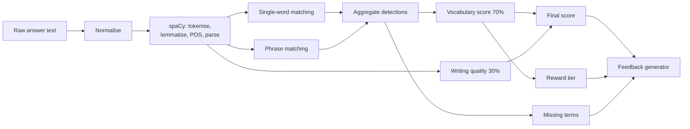

# NLP & Evaluation Architecture

> **Revision 2.0** — rewritten around the specification's 70/30 scoring model
> and the teacher-editable vocabulary library.

## 1. Purpose

The analysis engine takes a student's graph description and the target
vocabulary for that graph, and produces the vocabulary score, writing score,
final score, detected and missing term lists, reward tier and feedback stored in
`scores` ([02-database-schema.md](./02-database-schema.md) §4.3).

Built on **spaCy** (`en_core_web_sm`) for tokenisation, lemmatisation and
dependency parsing, and **NLTK** for sentence-level statistics.

## 2. Pipeline



## 3. Normalisation (FR-6.1)

1. Unicode NFKC normalisation, so curly quotes and typographic dashes do not
   fragment tokens.
2. Lowercasing.
3. Punctuation removal — except the internal hyphens and apostrophes that are
   part of a word, since stripping those would turn `bottom-out` into two
   unrelated tokens.
4. Whitespace collapsing.

The original text is never mutated; normalisation produces a parallel string,
and character offsets back into the original are preserved so detected terms can
be highlighted in the UI at their real positions.

## 4. Vocabulary detection

### 4.1 Lemma matching (FR-6.2)

Single-word terms are matched on **lemma**, not surface form. spaCy lemmatises
`increased`, `increasing`, `increases` and `increase` all to `increase`, so a
student is credited for the term regardless of the inflection they chose.

Surface matching would have failed here in a way that is easy to miss: the base
form `increase` is *less* common in real graph writing than `increased`, so a
naive string match would systematically under-credit correct usage.

Matching is restricted to content-word POS tags (`VERB`, `NOUN`, `ADJ`, `ADV`)
so an unrelated homograph in a function-word role is not counted.

### 4.2 Phrase matching (FR-6.3)

Multi-word terms — `higher than`, `lower than`, `compared with`, `bottom out`,
`highest point`, `lowest point` — are matched with spaCy's `PhraseMatcher` over
a lemma-attribute document, so `bottomed out` matches the stored `bottom out`.

`PhraseMatcher` is used rather than a regular expression because phrase terms
must respect token boundaries. A regex for `rise` would match inside `surprise`;
a regex for `higher than` would not survive `higher   than` across a line break.

Phrase matching runs **before** single-word matching, and matched spans are
masked. Without masking, `higher than` would also register a `high` detection,
double-counting one piece of student writing as two vocabulary hits.

### 4.3 Detection output

```json
{
  "detected": [
    {"term": "increase", "category": "increase", "count": 3,
     "positions": [[45, 54], [128, 137], [201, 209]], "matched_forms": ["increased", "increasing", "increase"]},
    {"term": "higher than", "category": "comparison", "count": 1, "positions": [[310, 321]]}
  ],
  "missing": [{"term": "fluctuate", "category": "fluctuation"}],
  "total_occurrences": 14,
  "unique_terms": 7,
  "target_count": 8
}
```

## 5. Scoring

### 5.1 Vocabulary score — 70% (FR-6.6, FR-6.8)

```
vocabulary_percentage = (unique target terms detected ÷ total target terms) × 100
vocabulary_score      = min(vocabulary_percentage, 100)
```

The numerator counts **unique** terms, not occurrences. Counting occurrences
would reward writing "increase" eight times over using eight different terms —
the exact opposite of the vocabulary range the platform is meant to teach.

The denominator is the graph's curated target set, falling back to a
type-derived default set when a teacher has not curated one (FR-5.6). See
[../PROJECT_PLAN.md](../PROJECT_PLAN.md) §3.2 for why the denominator is scoped
per graph rather than to the entire library.

Terms marked `is_required = false` are credited in the numerator but excluded
from the denominator, letting a teacher offer bonus vocabulary without making
the crown tier harder to reach.

### 5.2 Writing quality score — 30% (FR-6.7)

Four equally weighted components, each normalised to 0–100:

| Component | Measure | Rationale |
|---|---|---|
| **Word count adequacy** | Full marks in the 150–250 word band, tapering outside it | Graph description tasks have a conventional length; both a two-line answer and a rambling one miss the register |
| **Lexical diversity** | Moving-average type-token ratio over content lemmas | Plain TTR falls as text lengthens, so it would penalise longer answers for being longer. A moving average is length-stable |
| **Sentence structure** | Mean sentence length in a target band, plus a subordinate-clause ratio from the dependency parse | Academic description needs complex sentences, but not run-ons |
| **Overview presence** | Detects an opening summary via position and discourse cues (`overall`, `in general`, `the graph shows`) | An overview statement is the single most-taught convention of graph description writing |

These are **heuristics, not grammar checking**. They are named honestly in the
API as a writing *signal*. The 30% weight reflects that: the specification puts
vocabulary at the centre, and these measures are supporting evidence.

### 5.3 Final score (FR-6.8)

```
final_score = 0.70 × vocabulary_score + 0.30 × writing_score
```

Weights are configuration, not constants in code, so the rubric can be retuned
for a study without a redeploy.

### 5.4 Reward tier (FR-7.1)

Derived from **vocabulary percentage**, not final score — the specification
states the thresholds in those terms ("90% or above vocabulary usage").

| Vocabulary % | Tier |
|---|---|
| ≥ 90 | `crown` |
| 60 – 89 | `flower` |
| 50 – 59 | `steady` |
| < 50 | `hammer` |

The `steady` tier fills a gap the specification leaves open between 50% and 59%.
See [../PROJECT_PLAN.md](../PROJECT_PLAN.md) §3.1.

## 6. Feedback generation (FR-6.10)

Feedback is **template-driven**, assembled from the computed metrics — not
generated by a language model. Three reasons:

1. It is deterministic and reproducible, which an academic evaluation requires.
2. It cannot hallucinate praise for vocabulary the student did not use.
3. It needs no external API, keeping the system self-contained and free to run.

```json
{
  "headline": "Rising Writer",
  "message": "Strong work. You used 7 of the 8 target terms for this graph.",
  "strengths": [
    "Good range of increase language: increased, surged, climbed",
    "Clear overview sentence at the start"
  ],
  "improvements": [
    "The middle section moves up and down — 'fluctuate' or 'vary' would describe it precisely",
    "Try one comparison, such as 'higher than', to contrast the two series"
  ],
  "missing_by_category": {"fluctuation": ["fluctuate", "vary"]},
  "next_step": "Attempt another line graph and aim to include fluctuation language."
}
```

Improvement suggestions are drawn from the **missing** terms of the categories
most relevant to the graph type, so the advice names the specific words to try
next rather than telling the student to "use better vocabulary".

## 7. Engine versioning

Every score records `engine_version`. When matching rules or weights change,
historical scores remain interpretable — essential when the project's research
findings depend on comparing cohorts scored weeks apart.

## 8. Performance

Analysis of a 300-word response completes in well under the 2-second budget of
NFR-1.2. The spaCy pipeline is loaded **once at application start**, with
unnecessary components disabled (`ner` is not used and is the most expensive
stage in the default pipeline). The `PhraseMatcher` is rebuilt only when the
vocabulary library changes, not per request.

## 9. Implementation notes

Recorded during implementation. Where the built engine departs from §§2–8 above,
the deviation and its reason are stated here rather than the section quietly
rewritten.

### 9.1 Normalisation does not lowercase or strip punctuation

FR-6.1 asks for case- and punctuation-insensitive matching, and the engine
delivers it — but through spaCy's `LOWER` and `LEMMA` token attributes rather
than by editing the text first, which §3 implies.

Doing it literally would be actively harmful. The POS tagger is trained on
cased text and degrades sharply on a lowercased input, and the POS tag is
precisely what stops a homograph in a function-word role being counted (§4.1).
Punctuation never participates in token-based matching, so removing it buys
nothing and destroys the sentence segmentation the writing score depends on.

Normalisation is therefore limited to what genuinely helps: typographic
characters mapped to ASCII, invisible characters removed, whitespace runs
collapsed. Each output character keeps an index back to the character it came
from, so detected terms are reported at their real positions in the student's
own text.

Unicode normalisation is applied **per character**. Whole-string NFKC can
compose across character boundaries, which makes the index map ambiguous;
per-character NFKC covers every case English prose produces and keeps every
output character attributable to exactly one input character.

### 9.2 Lemma matching alone is not sufficient

spaCy falls back to suffix rules for words absent from its lookup tables, and
for at least one seeded term those rules are wrong:

| Written | spaCy lemma | Target | Credited by lemma? |
|---|---|---|---|
| `plateaued` | `plateaue` | `plateau` | no |
| `plateaus` | `plateaus` | `plateau` | no |
| `steadily` | `steadily` | `steady` | no |
| `fluctuation` | `fluctuation` | `fluctuate` | no |

The first three are lemmatiser errors; the last is not an error at all —
`fluctuation` is a *derivation*, a distinct lemma, and no inflection rule
reaches it. Graph description leans on these noun forms constantly ("a sharp
fluctuation", "a steady reduction", "considerable growth"), so leaving them out
systematically under-credits the more sophisticated construction.

Two matchers therefore run, and a token matching either is credited:

1. **Lemma** — the primary mechanism, and the only one that reaches irregulars
   (`rose` → `rise`, `fell` → `fall`).
2. **Surface** — inflections *and* nominalisations generated from the target
   term itself.

The direction is what makes the second safe. Nothing is inferred from what the
student wrote; forms are derived only from a term a teacher curated. Crediting
one therefore requires the student to have written an actual form of that term.
A generated form that is not a real word (`fluctuateion`, `constantest`) simply
never matches, so an over-generating rule costs nothing while a missing one
costs a student marks.

### 9.3 Phrase patterns are built from explicit lemmas

Phrase patterns are `Doc` objects constructed with their lemmas set directly,
not produced by running the pipeline over the pattern string. Lemmatising a
bare fragment out of context is where the tagger is least reliable, and a
mis-lemmatised pattern is a term that can never match anything — a silent
scoring failure rather than a visible one.

### 9.4 Sentence segmentation uses spaCy, not NLTK

§1 names NLTK for sentence-level statistics. The implementation uses spaCy's
parser for segmentation instead, because the subordinate-clause ratio needs the
dependency parse anyway: segmenting with punkt and parsing with spaCy would
compute mean sentence length over one segmentation and the clause ratio over
another, and the two do not always agree.

NLTK remains a declared dependency but is currently unused.

### 9.5 Lexical diversity is calibrated, and guarded against short answers

The MATTR anchors are not textbook figures. The measure here runs over content
lemmas with stop words removed, which lifts the ratio well above published
values. Measured on this pipeline:

| Answer | MATTR |
|---|---|
| One verb repeated throughout | 0.31 |
| Ordinary student answer | 0.57 |
| Varied academic prose | 0.83 |

Anchors of 0.45 → 0 and 0.85 → 100 place the scale where real answers land and
leave headroom above a competent answer.

A short-text guard attenuates the score below 50 content lemmas. A type-token
ratio is 1.0 for any text too short to repeat itself, so without it the
shortest and weakest answers would earn **full marks** on the component meant
to reward vocabulary breadth.

### 9.6 Word-count tapers are asymmetric

Below the band the score tapers linearly to zero. Above it, it tapers to a
floor of 35 rather than to zero: writing too much is a lesser failure than
writing two lines, because the student has engaged with the task and produced
material to work with.

### 9.7 An overview outside the opening earns partial credit

§5.2 detects the overview by position and discourse cue. A cue found later than
the opening scores 60 rather than 0. A summary in the final paragraph is a real
overview and a real skill; it is simply not where the convention puts it.
Scoring it zero would teach the student that summarising is wrong rather than
that it belongs at the top.

### 9.8 Suggestions are quotaed by kind

At most two of the three improvement suggestions may be about vocabulary.
Without the quota a weak answer generates so many missing-category suggestions
that they fill every slot — so the students who most need to be told to open
with an overview are exactly the ones never told. Unused writing slots return
to vocabulary, which is still 70% of the score.

A category the student *has* used is phrased differently from one they have
not ("widen the increase language" versus "no increase language yet"). Telling
a student they used no increase language when they wrote *increased* is the
fastest way to lose their trust in the feedback.

### 9.9 Missing-term suggestions are ordered by weight, ascending

Term weights do not enter the score: FR-6.6 is an unweighted count of unique
terms, and it is implemented as one. Weight is used only to order the words a
student is advised to try next, lightest first, so the advice names the most
basic missing term rather than the most sophisticated. Advice a struggling
student cannot act on is not advice.

### 9.10 The engine version fingerprints the rubric

§7 records `engine_version` on every score so historical results stay
interpretable. The code version alone cannot do that. Weights and tier
thresholds are deployment configuration *precisely so* a study can retune them
without a redeploy (§5.3) — which means two scores could carry the same version
and yet be incomparable, silently invalidating the cohort comparison the field
exists to protect.

The stored value is therefore `1.0.0+<digest>`, where the digest covers the
weights, the three tier thresholds and the word-count band. A retuned rubric
produces a visibly different version string.

### 9.11 A missing model degrades rather than crashes

Analysis is not optional the way OCR is — without it nothing can be scored. The
server still starts without the language model: students can sign in, read
their history and practise, and the operator sees one actionable warning naming
the download command instead of every submission failing at 500.

Scoring endpoints return **503** (`ANALYSIS_ENGINE_UNAVAILABLE`) in that state,
distinguishing a deployment fault from `ANALYSIS_FAILED` (422), which means
*this particular answer* could not be analysed.

`/health/ready` reports the model's state but never fails readiness on it. The
load is cached, so a probe that failed at boot stays failed for the life of the
process; flipping readiness on it would pull the instance out permanently
rather than for as long as the fault lasts.

### 9.12 The model answers are part of the contract

The seeded reference descriptions are the model answers a teacher is shown. A
target list its own model answer cannot satisfy is badly curated, and if the
model answer cannot reach the crown no student will either.

Running the engine over the shipped content found three graphs whose target
lists asked for phrases their reference description never used, and all four
answers falling short of the 150-word minimum their own prompt states. Both
were fixed in the seed data, and an integration test now asserts that every
model answer reaches 100% vocabulary, opens with an overview, and meets the
word-count band.

### 9.13 Compiled matchers are bound to the pipeline that built them

`PhraseMatcher` reports matches as hashes into its own `Vocab`'s string store.
A matcher cached across a pipeline reload therefore fails with `[E018] Can't
retrieve string for hash` — or, if the hash happens to resolve, silently
matches the wrong term, which is worse.

The compiled-target cache holds a reference to the vocabulary it was built
against and drops the whole cache when the pipeline no longer matches. In
production the pipeline is loaded once and never reloaded, so this never fires;
it exists because the failure mode is silent and the guard is two lines.
