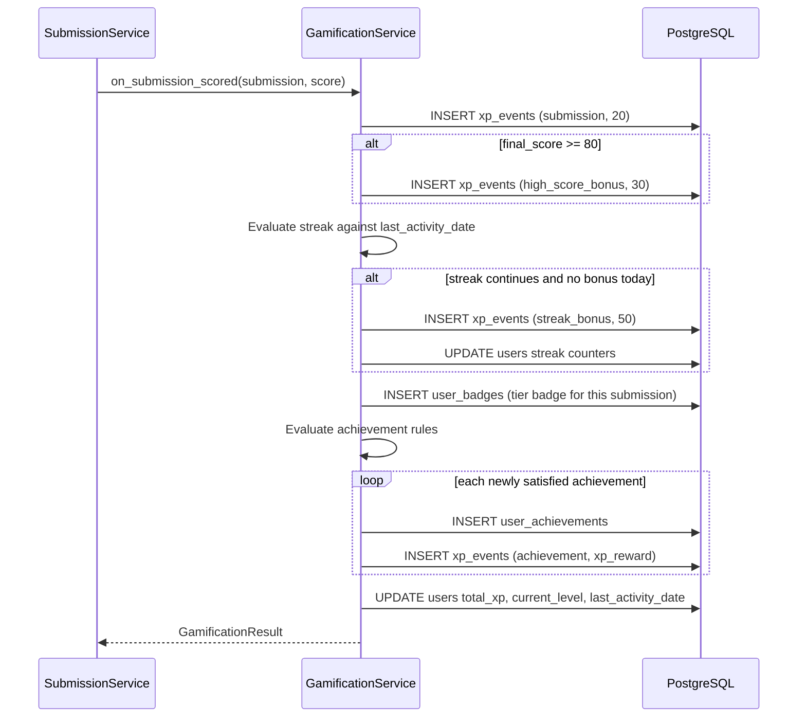

# Gamification Architecture

> **Revision 2.0** — rewritten around the specification's reward tiers, XP
> values, achievement catalogue and four leaderboard scopes.

## 1. Overview

Four coordinated mechanics: **reward tiers**, **XP and levels**, **achievements
and badges**, and **leaderboards**. All are driven from a single entry point,
`GamificationService.on_submission_scored()`, so the rules exist in exactly one
place rather than being re-derived at each call site.

## 2. Reward tiers

The centrepiece of the student experience: an animated response scaled to
vocabulary usage.

| Vocabulary % | Tier | Title (male / female) | Badge | Animation |
|---|---|---|---|---|
| ≥ 90 | `crown` | Graph King / Graph Queen | Royal Vocabulary Master | Golden crown descends, sparkle particles, confetti burst, victory sound |
| 60 – 89 | `flower` | Rising Writer | Rising Writer | Flower blooms and rotates, positive chime, avatar cheers |
| 50 – 59 | `steady` | Steady Learner | Steady Learner | Gentle encouraging pulse, soft chime, avatar nods |
| < 50 | `hammer` | Keep Practicing! | Practice Needed | Cartoon hammer bonk, dizzy stars, brief fall, recovery, motivational message |

Crown titles branch on `users.gender` (FR-7.2), which is why gender is stored on
the user rather than only used at registration to pick an avatar.

### 2.1 The hammer tier, and why it is designed carefully

The specification is emphatic that the low-score animation must stay humorous
and never become humiliating (FR-7.6). This constrains the design rather than
decorating it:

- The hammer is **cartoon** — oversized, comic, physically impossible. It reads
  as slapstick, not as harm.
- The avatar **always recovers within the same sequence**. The animation never
  ends on the character down; recovery is part of the beat, not an optional
  follow-up.
- It **always** ends with "Keep Practicing! You Can Improve!" (FR-7.7). The
  comedy and the encouragement are one unit and cannot be separated.
- It is **skippable and replayable** (FR-7.9), so a student who does not find it
  funny is never forced to sit through it.
- It is **never shown to anyone else**. Tier badges appear on a student's own
  result and dashboard; the leaderboard shows XP and level, never a hammer count.
- `prefers-reduced-motion` reduces it to a static card with the same message
  (FR-7.10).

The 50–59% `steady` tier exists for the same reason. Widening the hammer band to
cover a 59% score — a student who used more than half the target vocabulary —
would land the joke on someone who is close to succeeding.

### 2.2 Sound

Sound is **muted by default** until the student explicitly opts in (FR-7.11).
Audio that starts unprompted is hostile in a shared computer lab or a library,
which is exactly where this platform is used. Browsers also block unprompted
autoplay, so an unmuted default would fail silently and inconsistently anyway.

## 3. XP system

### 3.1 Award rules (FR-8.1 – FR-8.3)

| Reason | Amount | Condition |
|---|---|---|
| `submission` | 20 | Every submission reaching `scored` |
| `high_score_bonus` | 30 | `final_score ≥ 80` |
| `streak_bonus` | 50 | First qualifying submission of a day that continues a streak |
| `achievement` | varies | The unlocked achievement's `xp_reward` |
| `manual_adjustment` | varies | Admin correction; requires a note |

A maximum-value submission therefore yields 100 XP plus any achievement rewards.

### 3.2 Append-only ledger

Every award inserts an `xp_events` row. `users.total_xp` is a cache updated in
the same transaction. The ledger is never updated or deleted; corrections are
offsetting entries.

This matters concretely for the **weekly and monthly leaderboards**: XP within a
period simply cannot be derived from a lifetime total. Without the ledger,
FR-9.3 would be unimplementable.

Ledger entries carry `clock_timestamp()` rather than `now()`. `now()` is the
*transaction* timestamp, so the four entries one scoring can append — base
award, high score bonus, streak bonus, achievement reward — would all share a
single value and their order would fall back to a random UUID. An append-only
ledger that cannot be read back in the order it was written is not much of a
ledger.

The once-per-day streak rule is enforced by a partial unique index rather than
by an application check:

```sql
CREATE UNIQUE INDEX ux_xp_streak_daily
  ON xp_events (user_id, (created_at::date))
  WHERE reason = 'streak_bonus';
```

An application-level "have they already got today's bonus?" check is a
read-then-write race: two submissions arriving together both read "no" and both
insert. The index makes the database reject the second one.

### 3.3 Levels (FR-8.5)

100 levels, derived deterministically from total XP:

```
xp_required_to_reach(level n) = 25 × (n − 1) × n
```

| Level | Cumulative XP | Submissions at ~50 XP |
|---|---|---|
| 2 | 50 | 1 |
| 5 | 500 | 10 |
| 10 | 2,250 | 45 |
| 25 | 15,000 | 300 |
| 50 | 61,250 | 1,225 |
| 100 | 247,500 | 4,950 |

Quadratic rather than exponential: an exponential curve makes the first levels
trivial and everything past level 20 unreachable within a semester. This curve
keeps early levels quick — level 5 within a first session — while leaving the
upper range meaningful across a full course.

`current_level` is recomputed on every XP write and cached on `users`, so no
level lookup requires a ledger scan.

## 4. Achievements

### 4.1 Declarative rules (FR-8.9)

Each achievement carries a JSONB `rule` evaluated by the service, so adding an
achievement is a data change rather than a code change:

```json
{"type": "submission_count", "threshold": 10}
{"type": "streak_days", "threshold": 7}
{"type": "reward_tier_count", "tier": "crown", "threshold": 1}
{"type": "final_score_threshold", "threshold": 100}
{"type": "vocabulary_percentage_threshold", "threshold": 90, "consecutive": 3}
{"type": "distinct_graph_types", "threshold": 4}
```

### 4.2 Catalogue

| Code | Title | Rule | XP |
|---|---|---|---|
| `first_submission` | First Steps | `submission_count` ≥ 1 | 50 |
| `ten_submissions` | Getting Serious | `submission_count` ≥ 10 | 100 |
| `fifty_submissions` | Dedicated Learner | `submission_count` ≥ 50 | 300 |
| `hundred_submissions` | Centurion | `submission_count` ≥ 100 | 500 |
| `graph_king` | Graph King | `reward_tier_count` crown ≥ 1, male | 200 |
| `graph_queen` | Graph Queen | `reward_tier_count` crown ≥ 1, female | 200 |
| `vocabulary_master` | Vocabulary Master | `vocabulary_percentage_threshold` 90, 3 consecutive | 400 |
| `consistency_champion` | Consistency Champion | `streak_days` ≥ 7 | 250 |
| `perfect_score` | Perfect Score | `final_score_threshold` = 100 | 500 |
| `well_rounded` | Well Rounded | `distinct_graph_types` ≥ 4 | 150 |

`graph_king` and `graph_queen` are gender-gated so each student has exactly one
reachable crown achievement — matching the titles in FR-7.2 without giving
anyone two achievements for one accomplishment.

### 4.3 Evaluation

Rules are evaluated once per scoring, immediately after XP is awarded, since
every rule type derives from submission history, streaks or scores.
`UNIQUE (user_id, achievement_id)` guarantees single award (FR-8.8) at the
database level, so a concurrent double-submission cannot double-unlock.

## 5. Streaks

- A streak extends when a submission reaches `scored` on the calendar day after
  `last_activity_date`.
- Same-day submissions do not extend it — the 50 XP bonus is once per day
  (§3.2), so a student cannot farm it by submitting repeatedly.
- A skipped day resets `current_streak_days` to 1.
- `longest_streak_days` is preserved permanently for the profile even after a
  streak breaks.
- Day boundaries use the platform timezone, configured once, so that a single
  cohort's students all roll over together.

### 5.1 The bonus is paid for continuing, not for turning up

`streak_bonus` requires a streak of **at least two days**. A first submission,
and a submission that restarts a broken streak, both earn nothing extra.

Paying it on a reset day would reward breaking a streak exactly as much as
keeping one, and would hand 50 XP to a student who practises once a week — the
opposite of what the mechanic is for. The counters still advance in both cases;
only the payment is withheld.

## 6. Leaderboards

### 6.1 Scopes (FR-9.1 – FR-9.3)

| Scope | Window | Population |
|---|---|---|
| `global` | All time | Every active student |
| `class` | All time | One class |
| `weekly` | ISO week, Monday start | Every active student |
| `monthly` | Calendar month | Every active student |

### 6.2 Ranking (FR-9.4)

Ordered by XP within the period, then average score, then achievement count:

```sql
RANK() OVER (
  ORDER BY period_xp DESC,
           average_score DESC,
           achievement_count DESC
)
```

Two tie-breakers are used because XP ties are common in a class of 40 — most
students submit a similar number of times — and an arbitrary order would make
the ranking look broken to the students it is meant to motivate.

### 6.3 Materialisation (NFR-1.4)

Rankings are computed into `leaderboard_entries` rather than ranked per
request. Ranking the full user set on every page view is a full-table scan of
the XP ledger, and a live ranking also shifts under a student's feet
mid-session in a way that reads as a bug rather than as competition.

Nothing schedules that computation in a single-container deployment, so **a
stale period is rebuilt by the read that notices it** — `LEADERBOARD_CACHE_MINUTES`
decides how stale is stale. That keeps the board correct without a cron daemon,
at the cost of one slow request per period per window. `POST /leaderboard/refresh`
forces it for every scope plus one board per active class.

A rebuild is delete-then-insert, so two of them running together would both
clear the period. Two things stop that going wrong:

- A **PostgreSQL advisory lock** held for the rest of the transaction, so
  readers who all find the period stale at once produce one rebuild rather than
  a pile-up. The second re-checks staleness once it holds the lock and skips.
- A **partial unique index** on `(scope, period_start, user_id) WHERE class_id
  IS NULL`. `uq_leaderboard_entry` includes `class_id`, which is NULL for every
  scope except `class`, and NULLs do not compare equal — so it constrains the
  class board and nothing else. Without the partial index a duplicated rebuild
  listed every student twice, silently, with no error to notice.

Where no advisory lock is available the rebuild runs inside a savepoint, so
losing the race abandons it and serves the rankings already on disk rather than
failing the request.

`GET /leaderboard/me` (FR-9.5) reads the caller's stored row directly, so a
student ranked 240th sees their own position without paginating to find it.

Three aggregates — period XP, average score, achievements unlocked — are each
computed in their own grouped subquery and joined in. Joining the tables
directly would multiply the rows: a student with 5 XP events and 3 submissions
would have their average taken over 15, producing numbers that are silently
wrong rather than an error.

Only students with activity **in the period** are ranked. A weekly board
listing every enrolled student on zero buries the handful who actually worked.

### 6.4 Teachers and admins are excluded

Leaderboards rank students only. A teacher who tries the exercise should not
appear above their own class.

### 6.5 Class boards are not browsable

A class board names identifiable classmates, so students are pinned to their
own class and a `class_id` they supply is ignored rather than honoured.
Teachers may read boards for classes they own; administrators, any.

An entry carries rank, name, avatar, level, XP, average score, submission count
and achievement count — and **never a reward tier**. A hammer count is a
private detail of one student's own results screen; publishing it to their
cohort is exactly the humiliation FR-7.6 rules out.

## 7. Award flow



The entire flow runs in **one transaction** with the score insert. A partial
commit would leave a scored submission with no XP, or XP with no badge — states
the student would see as the system losing their work.

## 8. Anti-abuse

| Risk | Mitigation |
|---|---|
| Spamming empty submissions for 20 XP each | Rate limit of 60 analyses per hour per user; a low score earns no bonus, and XP without score improvement does not move the leaderboard's tie-breakers |
| Farming the daily streak bonus | Partial unique index makes a second same-day award impossible (§3.2) |
| Re-unlocking achievements | `UNIQUE (user_id, achievement_id)` |
| Burst submissions before a snapshot | Rate limiting bounds XP per window; period XP comes from the ledger, so a burst is visible and auditable |
| Correcting an over-award | Offsetting `manual_adjustment` entries, never editing history |
| Double-awarding one submission | `analyze` locks the submission row before reading its status, so two racing calls serialise and only one pays out |

`POST /gamification/adjustments` is the only endpoint that writes XP outside
scoring. It is administrator-only, appends rather than edits, requires a note —
an unexplained correction is indistinguishable from tampering once the ledger is
research evidence — and refuses an adjustment that would take a student below
zero, which `users.total_xp`'s CHECK would otherwise reject as an opaque 500.
