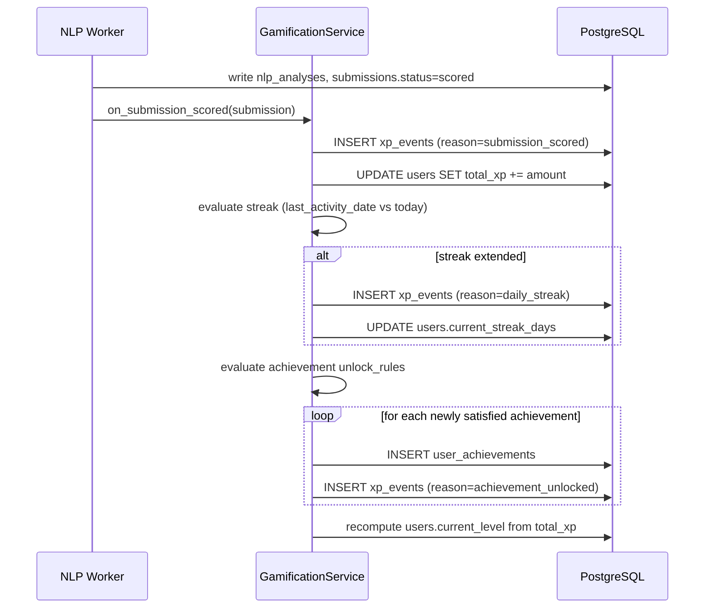
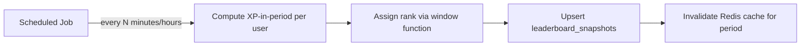

# Gamification Architecture

## 1. Overview

Gamification drives engagement through three coordinated mechanics — **XP/levels**, **achievements**, and a **leaderboard** — built on the `xp_events`, `achievements`, `user_achievements`, and `leaderboard_snapshots` tables defined in [02-database-schema.md](./02-database-schema.md) §5. All three read from the same append-only ledger, keeping the system auditable and internally consistent.

## 2. XP System

### 2.1 Event-Sourced Ledger
Every XP-earning action inserts a row into `xp_events` rather than directly mutating a counter. `users.total_xp` is a denormalized cache updated in the same transaction as the ledger insert, giving O(1) profile reads while keeping the ledger as the reconstructable source of truth (rationale detailed in [03-er-diagram.md](./03-er-diagram.md) §3).

### 2.2 XP Award Triggers

| Reason (`xp_events.reason`) | Trigger | Amount Basis |
|---|---|---|
| `submission_scored` | NLP worker completes scoring (see [08-nlp-architecture.md](./08-nlp-architecture.md) §2) | Scaled from `submissions.overall_score`, e.g. `base_xp * (overall_score / 100)`, with a floor so any genuine attempt earns non-zero XP |
| `daily_streak` | First qualifying submission of a new calendar day extends `users.current_streak_days` | Flat bonus, increasing with streak length up to a cap (e.g., day 1–6 flat, day 7+ multiplier) |
| `achievement_unlocked` | An achievement's `unlock_rule` is satisfied (§3) | `achievements.xp_reward` |
| `manual_adjustment` | Admin correction (e.g., reversing XP from a since-deleted abusive submission) | Arbitrary, requires admin role and an audit note |

### 2.3 Award Flow



This flow runs inside `GamificationService` (see [05-backend-architecture.md](./05-backend-architecture.md) §8), invoked as a side effect of scoring completion — not duplicated at multiple call sites.

### 2.4 Levels
`users.current_level` is derived deterministically from `total_xp` via a level curve (e.g., XP thresholds increasing geometrically per level) defined as configuration, not hardcoded, so the curve can be tuned without a schema or code-path change — recomputed and cached on every XP-affecting write, consistent with the "cache derived from ledger" pattern in §2.1.

## 3. Achievements

### 3.1 Rule Model
Each `achievements` row carries a declarative `unlock_rule` (JSONB), evaluated by `GamificationService` rather than hardcoded per-achievement logic, so new achievements can be added via data (content-admin tooling or a seed migration) without a code deploy:

```json
{
  "type": "submission_count",
  "threshold": 1
}
```

```json
{
  "type": "streak_days",
  "threshold": 7
}
```

```json
{
  "type": "vocabulary_score_threshold",
  "threshold": 90,
  "consecutive": 3
}
```

### 3.2 Example Achievement Catalog

| Code | Title | Rule Type | Threshold |
|---|---|---|---|
| `first_submission` | First Steps | `submission_count` | 1 |
| `week_streak` | Consistent Learner | `streak_days` | 7 |
| `vocabulary_master` | Vocabulary Master | `vocabulary_score_threshold` (3 consecutive) | 90 |
| `chart_variety` | Well Rounded | `distinct_chart_types_attempted` | 4 |
| `leaderboard_top10` | Rising Star | `leaderboard_rank` | ≤10 (weekly) |

### 3.3 Evaluation Trigger
Achievement rules are evaluated at the same point XP is awarded (§2.3) — after a submission is scored — since nearly every rule type derives from submission history, streaks, or scores. Rules that depend on leaderboard rank (e.g., `chart_variety`'s peers) are instead evaluated as part of the leaderboard snapshot job (§4.2), since rank is only meaningful at snapshot time.

## 4. Leaderboard

### 4.1 Why Snapshots, Not Live Ranking
Computing `RANK() OVER (ORDER BY total_xp DESC)` live on every leaderboard page view does not scale with learner count and produces a ranking that shifts mid-session in a way that feels arbitrary to users. Instead, `leaderboard_snapshots` (see [02-database-schema.md](./02-database-schema.md) §5.4) materializes rankings on a fixed cadence.

### 4.2 Computation Strategy



- A scheduled job (not a request-triggered computation) aggregates `xp_events` within each period window (`daily`, `weekly`, `all_time`) and writes ranked rows to `leaderboard_snapshots`.
- `GET /gamification/leaderboard` ([04-api-design.md](./04-api-design.md) §3.7) reads the latest snapshot for the requested period, optionally cached in Redis for the snapshot's validity window, rather than querying `xp_events` directly.
- **Refresh cadence** balances freshness against cost: `daily`/`weekly` snapshots refresh every few minutes; `all_time` refreshes less frequently since a single submission rarely reorders the full-history top ranks.

### 4.3 Ranking Windows
| Period | `period_start` granularity | Use case |
|---|---|---|
| `daily` | Calendar day | Short-term competitive motivation |
| `weekly` | ISO week start | Primary leaderboard view, resets engagement weekly |
| `all_time` | Fixed epoch (e.g., product launch date) | Long-term recognition |

## 5. Streaks

- `users.current_streak_days` increments when a qualifying submission (one that reaches `status = scored`) occurs on a calendar day following `users.last_activity_date`; it resets to 1 if a day is skipped.
- `users.longest_streak_days` is updated whenever `current_streak_days` exceeds it, preserved even after a streak breaks, for profile/achievement display.
- Streak evaluation uses the learner's recorded timezone (or a platform-default UTC day boundary if unset) to avoid ambiguous day-boundary edge cases; this is a configuration decision to be finalized during implementation, noted here as an open consideration.

## 6. Anti-Abuse Considerations

| Risk | Mitigation |
|---|---|
| Spamming low-effort submissions for `submission_scored` XP | XP is scaled by `overall_score`, so low-quality/gibberish text earns minimal XP; rate limiting on `POST /submissions` ([04-api-design.md](./04-api-design.md) §7) caps volume |
| Streak gaming via multiple trivial submissions per day | Streak XP is awarded once per calendar day regardless of submission count that day |
| Achievement replay | `user_achievements` unique constraint on `(user_id, achievement_id)` prevents re-awarding |
| Leaderboard manipulation via burst submissions right before snapshot | Snapshot refresh cadence (§4.2) combined with per-submission rate limiting bounds the maximum XP achievable in any short window |
| Retroactive correction (e.g., a scoring bug over-awarded XP) | Handled via `manual_adjustment` ledger entries (§2.2), never by deleting/editing historical `xp_events` rows, preserving audit integrity |
